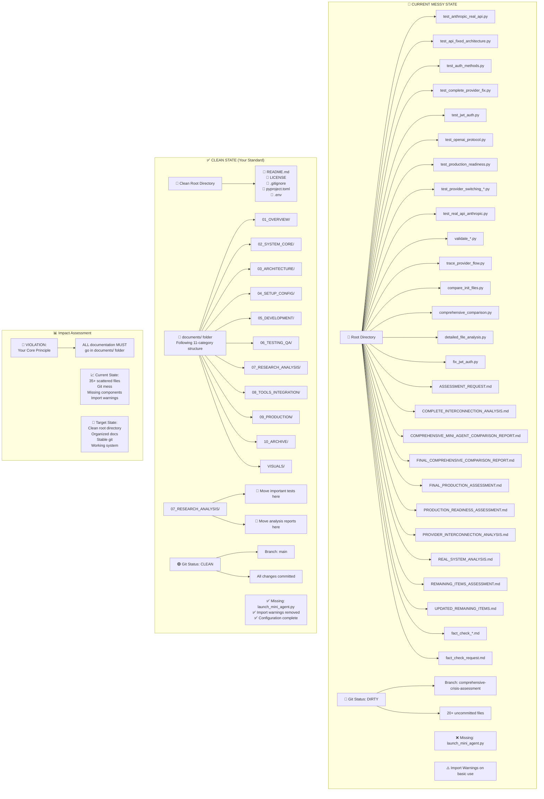
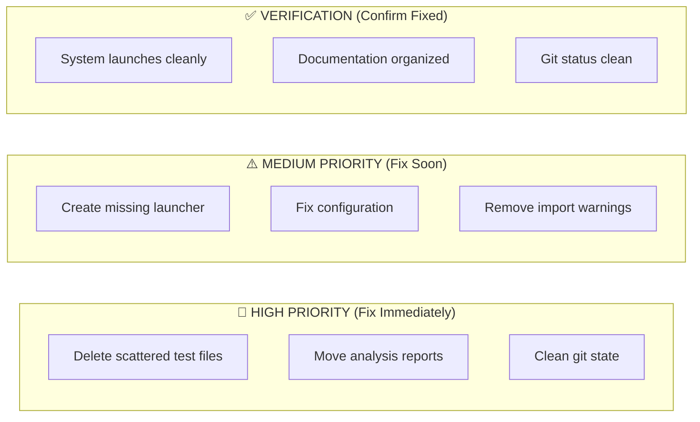

# 🔍 QA Issues - Visual Diagram

## Current Messy State vs Clean State



## Key Violations of Your Standards

```mermaid
flowchart LR
    subgraph "❌ YOUR RULE VIOLATIONS"
        Rule1[Rule: "ALL documentation in documents/"]
        Current1[Current: 35+ files in root]
        
        Rule2[Rule: "Clean main branch"]
        Current2[Current: Dirty dev branch]
        
        Rule3[Rule: "Organized structure"]
        Current3[Current: Test files scattered]
    end
    
    subgraph "🔧 WHAT NEEDS FIXING"
        Action1[DELETE: 25+ test files]
        Action2[MOVE: Reports to 07_RESEARCH_ANALYSIS/]
        Action3[CLEAN: Git branch state]
        Action4[FIX: Missing components]
        Action5[REMOVE: Import warnings]
    end
```

## Cleanup Priority



## Your Document Hygiene Standard

```mermaid
graph TD
    subgraph "✅ CORRECT ORGANIZATION"
        Documents[documents/ folder]
        Documents --> Essential[MASTER_INDEX.md<br/>QUICK_START.md]
        Documents --> Cat1[01_OVERVIEW/]
        Documents --> Cat2[02_SYSTEM_CORE/]
        Documents --> Cat3[03_ARCHITECTURE/]
        Documents --> Cat4[04_SETUP_CONFIG/]
        Documents --> Cat5[05_DEVELOPMENT/]
        Documents --> Cat6[06_TESTING_QA/]
        Documents --> Cat7[07_RESEARCH_ANALYSIS/]
        Documents --> Cat8[08_TOOLS_INTEGRATION/]
        Documents --> Cat9[09_PRODUCTION/]
        Documents --> Cat10[10_ARCHIVE/]
        Documents --> Cat11[VISUALS/]
    end
    
    subgraph "❌ WRONG ORGANIZATION (Current Mess)"
        RootWrong[Root directory]
        RootWrong --> TestFiles[25+ test files]
        RootWrong --> Reports[10+ analysis reports]
        RootWrong --> Scripts[Development scripts]
    end
    
    Standard[📋 Your Standard:<br/>"ALL documentation MUST go in documents/ folder<br/>Ensures future agents understand context"]
```

This visual shows exactly why you're frustrated - the current state completely violates your core document hygiene principle!