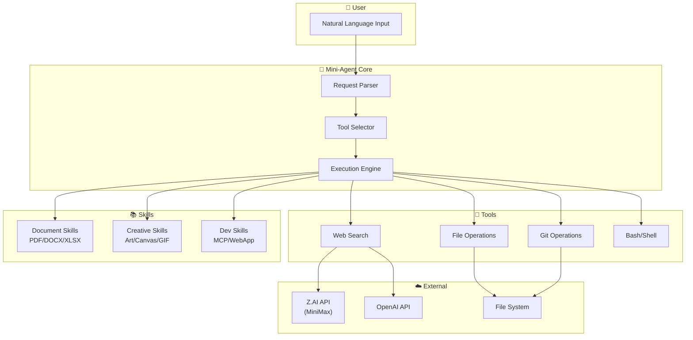

# Mini-Agent System Architecture Visual Guide

## 1. High-Level System Architecture

```
┌─────────────────────────────────────────────────────────────────────────────┐
│                           MINI-AGENT SYSTEM                                  │
│                     (MiniMax-M2 Code CLI Fork)                         │
└─────────────────────────────────────────────────────────────────────────────┘
                                    │
        ┌───────────────────────────┼───────────────────────────┐
        │                           │                           │
        ▼                           ▼                           ▼
┌───────────────┐         ┌───────────────┐         ┌───────────────┐
│   LLM Layer   │         │  Tools Layer  │         │ Skills Layer  │
│               │         │               │         │               │
│ • ZAI Client  │         │ • Web Search  │         │ • PDF/DOCX    │
│ • OpenAI      │         │ • File Ops    │         │ • Canvas      │
│ • MiniMax     │         │ • Git Ops     │         │ • Artifacts   │
│               │         │ • Bash/Shell  │         │ • MCP Builder │
└───────────────┘         └───────────────┘         └───────────────┘
        │                           │                           │
        └───────────────────────────┼───────────────────────────┘
                                    │
                                    ▼
                    ┌───────────────────────────────┐
                    │      Configuration Layer       │
                    │                               │
                    │  • config.yaml                │
                    │  • .env (API keys)            │
                    │  • Credit Protection          │
                    └───────────────────────────────┘
```

## 2. Directory Structure Tree

```
Mini-Agent/
│
├── 📁 mini_agent/                 ← CORE PACKAGE
│   ├── 📁 acp/                    ← Agent Communication Protocol
│   ├── 📁 config/                 ← Configuration files
│   │   └── config.yaml            ← Main config (in .gitignore)
│   ├── 📁 llm/                    ← LLM Client Implementations
│   │   └── zai_client.py          ← Z.AI/MiniMax integration
│   ├── 📁 schema/                 ← Data schemas
│   ├── 📁 skills/                 ← Skill Plugins (15+ skills)
│   │   ├── algorithmic-art/       
│   │   ├── artifacts-builder/     
│   │   ├── canvas-design/         
│   │   ├── document-skills/       ← PDF, DOCX, XLSX, PPTX
│   │   ├── mcp-builder/           
│   │   ├── webapp-testing/        
│   │   └── ... (10+ more)         
│   ├── 📁 tools/                  ← Tool Implementations
│   │   ├── __init__.py            ← Tool registration
│   │   ├── simple_web_search.py   ← Web search tool
│   │   ├── zai_unified_tools.py   ← Unified ZAI interface
│   │   └── _deprecated_zai/       ← Archived legacy tools
│   └── 📁 utils/                  ← Utility functions
│       └── credit_protection.py   ← Z.AI credit guard
│
├── 📁 documents/                  ← ALL DOCUMENTATION
│   ├── AGENT_HANDOFF.md           ← Handoff notes
│   ├── SYSTEM_ARCHITECTURE_VISUAL.md  ← This file
│   ├── 📁 _deprecated_zai_docs/   ← Archived ZAI docs
│   ├── 📁 architecture/           ← Design docs
│   ├── 📁 archive/                ← Old backups
│   └── 📁 research/               ← Research notes
│
├── 📁 scripts/                    ← UTILITY SCRIPTS
│   ├── 📁 testing/                ← Test scripts
│   ├── 📁 utilities/              ← Helper scripts
│   └── 📁 setup/                  ← Setup scripts
│
├── 📁 vscode-extension/           ← VS CODE EXTENSION
│   └── .gitignore                 ← Excludes node_modules
│
├── 📁 examples/                   ← Usage examples
├── 📁 tests/                      ← Unit tests
├── 📁 workspace/                  ← Working directory
│
├── .env                           ← API keys (in .gitignore)
├── .gitignore                     ← Git exclusions
├── README.md                      ← Project README
└── pyproject.toml                 ← Python project config
```

## 3. Data Flow Diagram

```
┌──────────────────────────────────────────────────────────────────────────┐
│                              USER INPUT                                   │
│                         (Natural Language Query)                          │
└────────────────────────────────────┬─────────────────────────────────────┘
                                     │
                                     ▼
┌──────────────────────────────────────────────────────────────────────────┐
│                           MINI-AGENT CORE                                 │
│  ┌─────────────────────────────────────────────────────────────────────┐ │
│  │                        Request Parser                                │ │
│  │              (Analyze intent, identify tools needed)                 │ │
│  └────────────────────────────────┬────────────────────────────────────┘ │
│                                   │                                      │
│                                   ▼                                      │
│  ┌─────────────────────────────────────────────────────────────────────┐ │
│  │                         Tool Selection                               │ │
│  │                                                                      │ │
│  │   ┌──────────┐  ┌──────────┐  ┌──────────┐  ┌──────────┐           │ │
│  │   │ File Ops │  │ Git Ops  │  │Web Search│  │  Bash    │           │ │
│  │   └────┬─────┘  └────┬─────┘  └────┬─────┘  └────┬─────┘           │ │
│  │        │              │              │              │                │ │
│  └────────┼──────────────┼──────────────┼──────────────┼───────────────┘ │
│           │              │              │              │                 │
│           ▼              ▼              ▼              ▼                 │
│  ┌─────────────────────────────────────────────────────────────────────┐ │
│  │                      Tool Execution Engine                           │ │
│  │                                                                      │ │
│  │   [read_file] [write_file] [edit_file] [git_*] [bash] [search]      │ │
│  │                                                                      │ │
│  └────────────────────────────────┬────────────────────────────────────┘ │
└───────────────────────────────────┼──────────────────────────────────────┘
                                    │
                                    ▼
┌──────────────────────────────────────────────────────────────────────────┐
│                        EXTERNAL SERVICES                                  │
│                                                                          │
│   ┌─────────────┐    ┌─────────────┐    ┌─────────────┐                 │
│   │   Z.AI API  │    │  OpenAI API │    │  File System│                 │
│   │  (MiniMax)  │    │  (Optional) │    │   (Local)   │                 │
│   └──────┬──────┘    └──────┬──────┘    └──────┬──────┘                 │
│          │                  │                  │                         │
│          └──────────────────┼──────────────────┘                         │
│                             │                                            │
└─────────────────────────────┼────────────────────────────────────────────┘
                              │
                              ▼
┌──────────────────────────────────────────────────────────────────────────┐
│                           RESPONSE                                        │
│                    (Formatted Output to User)                             │
└──────────────────────────────────────────────────────────────────────────┘
```

## 4. Skills System Architecture

```
                    ┌─────────────────────────┐
                    │     Skills Registry     │
                    │                         │
                    │  mini_agent/skills/     │
                    └───────────┬─────────────┘
                                │
        ┌───────────────────────┼───────────────────────┐
        │                       │                       │
        ▼                       ▼                       ▼
┌───────────────┐     ┌───────────────┐     ┌───────────────┐
│  Document     │     │   Creative    │     │  Development  │
│  Skills       │     │   Skills      │     │   Skills      │
│               │     │               │     │               │
│ • pdf         │     │ • algorithmic │     │ • mcp-builder │
│ • docx        │     │   -art        │     │ • webapp-     │
│ • xlsx        │     │ • canvas-     │     │   testing     │
│ • pptx        │     │   design      │     │ • skill-      │
│               │     │ • slack-gif   │     │   creator     │
│               │     │ • theme-      │     │ • vscode      │
│               │     │   factory     │     │   integration │
└───────────────┘     └───────────────┘     └───────────────┘
        │                       │                       │
        └───────────────────────┼───────────────────────┘
                                │
                                ▼
                    ┌─────────────────────────┐
                    │    Skill Loader         │
                    │                         │
                    │  get_skill(skill_name)  │
                    │  list_skills()          │
                    └─────────────────────────┘
```

## 5. Z.AI Integration & Credit Protection

```
┌─────────────────────────────────────────────────────────────────────────┐
│                     Z.AI / MiniMax Integration                           │
└─────────────────────────────────────────────────────────────────────────┘
                                    │
                                    ▼
┌─────────────────────────────────────────────────────────────────────────┐
│                        CREDIT PROTECTION SYSTEM                          │
│                                                                          │
│   Layer 1: Config Level                                                  │
│   ┌─────────────────────────────────────────────────────────────────┐   │
│   │  config.yaml: zai_enabled: false (default)                      │   │
│   └─────────────────────────────────────────────────────────────────┘   │
│                                    │                                     │
│   Layer 2: Import Level                                                  │
│   ┌─────────────────────────────────────────────────────────────────┐   │
│   │  tools/__init__.py: Only import if zai_enabled=true             │   │
│   └─────────────────────────────────────────────────────────────────┘   │
│                                    │                                     │
│   Layer 3: Runtime Level                                                 │
│   ┌─────────────────────────────────────────────────────────────────┐   │
│   │  credit_protection.py: Check before any API call                │   │
│   └─────────────────────────────────────────────────────────────────┘   │
│                                    │                                     │
│   Layer 4: Module Level                                                  │
│   ┌─────────────────────────────────────────────────────────────────┐   │
│   │  Each tool class checks protection on init                      │   │
│   └─────────────────────────────────────────────────────────────────┘   │
│                                                                          │
└─────────────────────────────────────────────────────────────────────────┘
                                    │
                    ┌───────────────┴───────────────┐
                    │                               │
                    ▼                               ▼
        ┌───────────────────┐           ┌───────────────────┐
        │   PROTECTED       │           │    ENABLED        │
        │                   │           │                   │
        │ • No API calls    │           │ • Full access     │
        │ • Clear error msg │           │ • ~120 prompts/   │
        │ • Safe default    │           │   5 hours         │
        └───────────────────┘           └───────────────────┘
```

## 6. File Relationships (Component Diagram)

```
┌────────────────────────────────────────────────────────────────────────────┐
│                           MINI-AGENT COMPONENTS                             │
└────────────────────────────────────────────────────────────────────────────┘

    ┌─────────────────┐          ┌─────────────────┐
    │   config.yaml   │◄────────►│     .env        │
    │                 │          │                 │
    │ • Settings      │          │ • ZAI_API_KEY   │
    │ • zai_enabled   │          │ • OPENAI_KEY    │
    └────────┬────────┘          └────────┬────────┘
             │                            │
             └──────────┬─────────────────┘
                        │
                        ▼
    ┌─────────────────────────────────────────────────────────────┐
    │                    mini_agent/llm/zai_client.py              │
    │                                                              │
    │  class ZAIClient:                                            │
    │    - __init__(api_key)                                       │
    │    - chat(messages)                                          │
    │    - web_search(query)                                       │
    │    - web_read(url)                                           │
    └──────────────────────────┬──────────────────────────────────┘
                               │
                               ▼
    ┌─────────────────────────────────────────────────────────────┐
    │                mini_agent/tools/__init__.py                  │
    │                                                              │
    │  Registers all available tools:                              │
    │    - simple_web_search                                       │
    │    - zai_unified_tools (if enabled)                          │
    │    - file operations                                         │
    │    - git operations                                          │
    └──────────────────────────┬──────────────────────────────────┘
                               │
                               ▼
    ┌─────────────────────────────────────────────────────────────┐
    │              mini_agent/utils/credit_protection.py           │
    │                                                              │
    │  def is_zai_protected() -> bool                              │
    │  def check_protection() -> None                              │
    │  def enable_zai() -> None                                    │
    └─────────────────────────────────────────────────────────────┘
```

## 7. Mermaid Diagram (Render on GitHub or mermaid.live)



## 8. Technology Stack

```
┌─────────────────────────────────────────────────────────────────────────┐
│                         TECHNOLOGY STACK                                 │
└─────────────────────────────────────────────────────────────────────────┘

┌─────────────────────────────────────────────────────────────────────────┐
│  FRONTEND / INTERFACE                                                    │
│  ┌──────────────┐  ┌──────────────┐  ┌──────────────┐                   │
│  │   CLI        │  │ VS Code Ext  │  │  Web UI      │                   │
│  │  (Primary)   │  │ (Extension)  │  │ (Planned)    │                   │
│  └──────────────┘  └──────────────┘  └──────────────┘                   │
└─────────────────────────────────────────────────────────────────────────┘

┌─────────────────────────────────────────────────────────────────────────┐
│  CORE APPLICATION                                                        │
│  ┌──────────────────────────────────────────────────────────────────┐   │
│  │  Python 3.11+                                                     │   │
│  │  ├── mini_agent/     (Core package)                              │   │
│  │  ├── uv              (Package manager)                           │   │
│  │  └── asyncio         (Async operations)                          │   │
│  └──────────────────────────────────────────────────────────────────┘   │
└─────────────────────────────────────────────────────────────────────────┘

┌─────────────────────────────────────────────────────────────────────────┐
│  LLM / AI SERVICES                                                       │
│  ┌──────────────┐  ┌──────────────┐  ┌──────────────┐                   │
│  │  Z.AI        │  │  OpenAI      │  │  Anthropic   │                   │
│  │  (MiniMax)   │  │  MiniMax-M2       │  │  MiniMax-M2      │                   │
│  │  GLM-4.5/4.6 │  │  (Optional)  │  │  (Base)      │                   │
│  └──────────────┘  └──────────────┘  └──────────────┘                   │
└─────────────────────────────────────────────────────────────────────────┘

┌─────────────────────────────────────────────────────────────────────────┐
│  INFRASTRUCTURE                                                          │
│  ┌──────────────┐  ┌──────────────┐  ┌──────────────┐                   │
│  │  Git/GitHub  │  │  Windows     │  │  Node.js     │                   │
│  │  Version Ctl │  │  PowerShell  │  │  (VS Code)   │                   │
│  └──────────────┘  └──────────────┘  └──────────────┘                   │
└─────────────────────────────────────────────────────────────────────────┘
```

---

## Quick Reference Commands

```bash
# Check repository status
git status
git log --oneline -n 5

# Python environment
uv venv
uv pip install -e .

# Run tests
python verify_integration.py
python debug_zai_credit_protection.py

# List all skills
ls mini_agent/skills/

# Check documentation
cat documents/AGENT_HANDOFF.md
```

---

*Generated by Mini-Agent on 2025-11-22*
