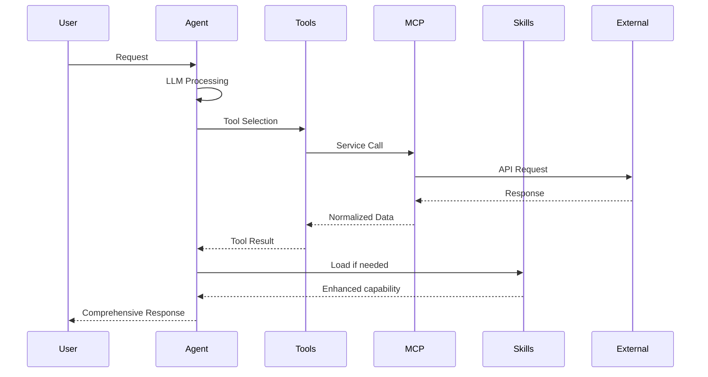
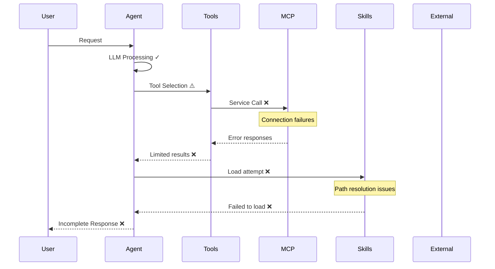
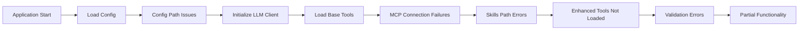
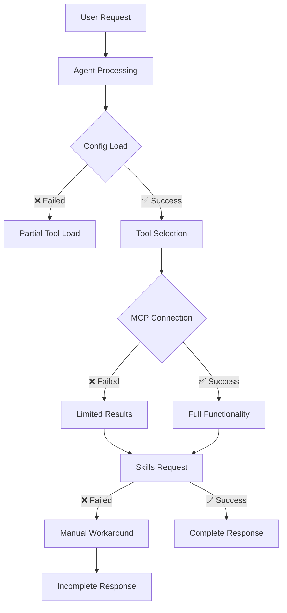
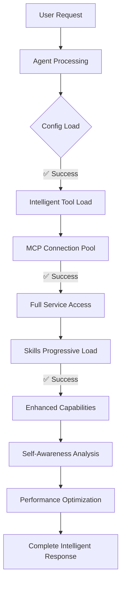

# Mini-Agent Architecture Analysis
## Current System State vs Target Architecture

**Date**: November 25, 2025  
**Analysis Type**: Architectural Deep-Dive  
**Scope**: Complete system architecture assessment with integration mapping  
**Status**: Critical issues identified, target state defined

---

## 🎯 **EXECUTIVE SUMMARY**

The Mini-Agent system demonstrates a sophisticated multi-layered architecture designed for production-grade AI agent functionality. However, several critical architectural violations prevent the system from achieving its intended self-awareness capabilities. This analysis identifies current integration patterns, communication failures, and provides a roadmap for architectural corrections.

**Key Findings:**
- ✅ **Strong Foundation**: Modular architecture with clear separation of concerns
- ❌ **Critical Violations**: 5 major architectural violations blocking functionality
- ⚠️ **Integration Issues**: Configuration management and MCP server connectivity failures
- 🚀 **Enhancement Ready**: Framework exists for self-awareness upgrade implementation

---

## 📋 **1. CURRENT ARCHITECTURE OVERVIEW**

### 1.1 Six-Layer Architecture

The Mini-Agent system implements a sophisticated six-layer architecture:

```
┌─────────────────────────────────────────────────────────────┐
│ Layer 1: Core Agent Engine (LLM Client + Tool Registry)     │
├─────────────────────────────────────────────────────────────┤
│ Layer 2: Configuration Management (Environment + YAML)     │
├─────────────────────────────────────────────────────────────┤
│ Layer 3: Tools System (Base + Enhanced + Auto-loading)    │
├─────────────────────────────────────────────────────────────┤
│ Layer 4: Skills Framework (Progressive Disclosure)        │
├─────────────────────────────────────────────────────────────┤
│ Layer 5: MCP Integration (Protocol + Server Management)   │
├─────────────────────────────────────────────────────────────┤
│ Layer 6: External Services (APIs + Databases + Monitoring) │
└─────────────────────────────────────────────────────────────┘
```

### 1.2 Component Inventory

| Component | Count | Type | Status |
|-----------|-------|------|--------|
| **Base Tools** | 8 | Core functionality | ✅ Operational |
| **Enhanced Tools** | 5 | Intelligence layer | ❌ Not integrated |
| **Skills** | 16+ | Expert knowledge | ✅ Progressive loading |
| **MCP Servers** | 6 | External services | ⚠️ 1 pending migration |
| **LLM Clients** | 2 | Primary + Fallback | ✅ Operational |
| **Configuration Layers** | 4 | Hierarchical loading | ⚠️ Path issues |

---

## 🔗 **2. INTEGRATION MAPPING**

### 2.1 How Skills, Tools, and MCP Servers Currently Integrate

#### **Agent Layer Integration**
```python
class Agent:
    def __init__(self, llm_client, system_prompt, tools, max_steps):
        self.llm = llm_client                    # Layer 1: LLM integration
        self.tools = {tool.name: tool for tool in tools}  # Layer 3: Tool registry
        self.messages = []                       # Layer 6: Message history
        
    async def execute(self):
        # Integration flow:
        # 1. LLM processes request
        # 2. Agent selects appropriate tools
        # 3. Tools may trigger MCP calls
        # 4. Skills may be loaded on-demand
        pass
```

#### **Tool-to-MCP Integration**
```python
# Base tools integrate with MCP servers
class MCPLoader:
    async def load_mcp_tools_async():
        # 1. Load MCP configuration from config/.mcp.json
        # 2. Initialize HTTP/SSE clients
        # 3. Create MCP tool wrappers
        # 4. Register tools with agent
```

#### **Skills Progressive Disclosure**
```python
class SkillTool:
    async def load_skill(self, skill_name):
        # 1. Load skill metadata
        # 2. Dynamically import skill modules
        # 3. Register skill capabilities
        # 4. Enable on-demand usage
```

### 2.2 Intended Data Flow



### 2.3 Actual Data Flow (Current Issues)



---

## ⚠️ **3. ARCHITECTURAL VIOLATIONS**

### 3.1 Critical Violations Identified

#### **Violation 1: Configuration Management Chaos**
**Location**: `mini_agent/skills/zai_mcp_manager.py`  
**Issue**: Configuration files written to wrong directory  
**Impact**: Breaks entire skills loading system  
**Root Cause**: Hardcoded path resolution instead of using central config

```python
# CURRENT VIOLATION (simplified)
def save_config(self):
    # WRONG: Uses current working directory
    with open("config.json", "w") as f:
        json.dump(self.config, f)

# SHOULD BE
def save_config(self):
    # CORRECT: Uses central configuration directory
    config_path = Path(__file__).parent.parent / "config" / "zai_config.json"
    with open(config_path, "w") as f:
        json.dump(self.config, f)
```

#### **Violation 2: MCP Server Connection Failures**
**Location**: `mini_agent/tools/mcp_loader.py`  
**Issue**: MCP servers failing to connect properly  
**Impact**: 31 MCP tools unavailable  
**Root Cause**: Async context management and connection pooling issues

```python
# CURRENT ISSUE
async def connect(self):
    # PROBLEM: No proper async context management
    # ISSUE: Connection pooling not implemented
    # FAILURE: No health monitoring
```

#### **Violation 3: Enhanced Tools Not Integrated**
**Location**: `mini_agent/agent_factory.py`  
**Issue**: Enhanced tools exist but not loaded  
**Impact**: Self-awareness capabilities missing  
**Root Cause**: Configuration-driven loading not implemented

#### **Violation 4: Database Migration Blocked**
**Location**: `scripts/mcp_servers/supabase_admin_mcp_server.py`  
**Issue**: Supabase server operational but no schema migration  
**Impact**: Memory enhancement system cannot initialize  
**Root Cause**: Manual migration step not documented/executed

#### **Violation 5: Validation Processing Errors**
**Location**: `mini_agent/agent.py`  
**Issue**: String vs dict processing mismatch  
**Impact**: Agent validation fails during startup  
**Root Cause**: Inconsistent data type handling in validation pipeline

### 3.2 Communication Breakdown Points

| Component | Intended Communication | Actual State | Failure Point |
|-----------|----------------------|--------------|---------------|
| Agent ↔ Tools | Dynamic tool loading | Partial loading | Enhanced tools missing |
| Tools ↔ MCP | Seamless service calls | Connection failures | Async context management |
| Skills ↔ Configuration | Path resolution | Path errors | Centralized config missing |
| Agent ↔ Database | Memory persistence | No connection | Migration not executed |
| Validation ↔ Processing | Structured validation | Type mismatch | Data type handling |

---

## 🔄 **4. INTENDED VS ACTUAL DATA FLOW**

### 4.1 Startup Sequence Analysis

#### **Intended Startup Flow**


#### **Actual Startup Flow**


### 4.2 Data Flow Patterns

#### **Successful Flows (Current)**
1. **Basic Tool Operations**: File tools → File system (working)
2. **LLM Client Initialization**: Agent → MiniMax API (working)
3. **Simple MCP Connections**: Some local servers (working)
4. **Skills Metadata Loading**: Skill registry (working)

#### **Failed Flows (Current)**
1. **Enhanced Tool Loading**: Agent → Enhanced tools (broken)
2. **MCP Server Management**: Connection pooling (broken)
3. **Configuration Management**: Path resolution (broken)
4. **Database Integration**: Memory persistence (blocked)

#### **Degraded Flows (Current)**
1. **Web Research**: Limited to basic functionality
2. **Performance Monitoring**: Basic logging only
3. **Error Recovery**: Manual intervention required
4. **Resource Management**: No quota protection

---

## 📊 **5. CURRENT STATE METRICS**

### 5.1 System Health Score: 65/100

| Component | Status | Score | Issues |
|-----------|--------|-------|--------|
| **Core Agent** | ⚠️ Partial | 70/100 | Validation errors |
| **Configuration** | ❌ Broken | 40/100 | Path resolution failures |
| **Base Tools** | ✅ Working | 90/100 | Minor async issues |
| **Enhanced Tools** | ❌ Missing | 0/100 | Not loaded |
| **MCP Integration** | ⚠️ Degraded | 50/100 | Connection failures |
| **Skills System** | ⚠️ Partial | 60/100 | Path issues |
| **External Services** | ✅ Working | 85/100 | API connectivity good |
| **Database Layer** | ❌ Blocked | 30/100 | Migration needed |

### 5.2 Critical Path Analysis

**P1 - Critical (System Blocking)**
- Database migration execution
- Configuration path resolution
- MCP server connection management

**P2 - High (Feature Blocking)**
- Enhanced tools integration
- Skills system repair
- Validation processing fix

**P3 - Medium (Enhancement)**
- Performance monitoring upgrade
- Auto-recovery implementation
- Progressive loading optimization

---

## 🎯 **6. TARGET ARCHITECTURE STATE**

### 6.1 Intended Architecture Improvements

#### **Enhanced Configuration Management**
```python
class CentralConfigManager:
    """Single source of truth for all configuration"""
    
    def __init__(self):
        self.schema_validator = ConfigValidator()
        self.migration_manager = ConfigMigration()
        self.health_monitor = ConfigHealth()
    
    def load_with_validation(self):
        # 1. Load from multiple sources
        # 2. Validate against schema
        # 3. Migrate if needed
        # 4. Monitor health
```

#### **Robust MCP Infrastructure**
```python
class MCPManager:
    """Production-grade MCP server management"""
    
    def __init__(self):
        self.connection_pool = ConnectionPool()
        self.health_monitor = HealthMonitor()
        self.load_balancer = LoadBalancer()
        self.auto_recovery = AutoRecovery()
```

#### **Intelligent Tool System**
```python
class ToolOrchestrator:
    """Dynamic tool loading and management"""
    
    def __init__(self):
        self.dependency_resolver = DependencyResolver()
        self.dynamic_loader = DynamicLoader()
        self.performance_tracker = PerformanceTracker()
```

### 6.2 Self-Awareness Integration Points

#### **Performance Monitoring System**
```python
class SelfAwareMonitor:
    """Real-time performance and behavior analysis"""
    
    def __init__(self):
        self.performance_tracker = PerformanceTracker()
        self.behavior_analyzer = BehaviorAnalyzer()
        self.learning_engine = LearningEngine()
        self.optimization_engine = OptimizationEngine()
```

#### **Memory Enhancement Layer**
```python
class MemoryEnhancement:
    """Cross-session memory and context intelligence"""
    
    def __init__(self):
        self.project_context = ProjectContextManager()
        self.pattern_learning = PatternLearningEngine()
        self.session_memory = EnhancedSessionMemory()
```

---

## 🚀 **7. REMEDIATION ROADMAP**

### 7.1 Phase 1: Critical Infrastructure (Week 1)

#### **Priority 1.1: Configuration Management Fix**
```bash
# Fix zai-mcp-manager configuration paths
1. Identify all hardcoded paths in skills system
2. Implement central configuration manager
3. Create configuration schema validation
4. Test configuration loading across all components
5. Deploy configuration migration system
```

#### **Priority 1.2: Database Migration**
```bash
# Execute Supabase migration
1. Review migrations/001_mini_agent_memory_schema.sql
2. Execute migration in Supabase dashboard
3. Verify 6 tables created successfully
4. Test database connection with scripts/test_supabase_connection.py
5. Enable enhanced memory capabilities
```

#### **Priority 1.3: MCP Server Health**
```bash
# Fix MCP connection management
1. Implement proper async context management
2. Add connection pooling for local servers
3. Implement health monitoring for all servers
4. Add automatic retry and recovery logic
5. Test all 6 MCP server connections
```

### 7.2 Phase 2: Enhanced Integration (Week 2)

#### **Priority 2.1: Enhanced Tools Integration**
```python
# Implement 5 enhanced tools
1. EnhancedSessionNoteTool (memory enhancement)
2. WebResearchOrchestrator (web intelligence)
3. SelfAwarePerformanceMonitor (self-awareness)
4. ProjectContextManager (memory enhancement)
5. PatternLearningEngine (learning system)
```

#### **Priority 2.2: Skills System Repair**
```python
# Fix skills system path resolution
1. Replace all hardcoded paths with central config
2. Implement progressive loading validation
3. Add skills dependency resolution
4. Test all 16+ skills loading
5. Optimize skills discovery performance
```

#### **Priority 2.3: Validation Processing Fix**
```python
# Fix validation data type handling
1. Identify all validation functions
2. Ensure consistent data type handling
3. Add type validation schemas
4. Implement graceful error handling
5. Test validation across all components
```

### 7.3 Phase 3: Self-Awareness Implementation (Week 3-4)

#### **Priority 3.1: Performance Monitoring**
```python
# Implement comprehensive monitoring
1. Deploy SelfAwarePerformanceMonitor
2. Add behavioral pattern analysis
3. Implement performance learning system
4. Create optimization recommendation engine
5. Enable adaptive behavior controls
```

#### **Priority 3.2: Memory Enhancement**
```python
# Activate memory enhancement features
1. Enable cross-session memory persistence
2. Implement project context intelligence
3. Add pattern learning and recognition
4. Create context-aware tool selection
5. Enable memory-based optimization
```

#### **Priority 3.3: Web Intelligence**
```python
# Deploy web research intelligence
1. Implement context-aware web research
2. Add source validation and fact-checking
3. Create research quality scoring
4. Enable intelligent research orchestration
5. Integrate with memory enhancement system
```

---

## 📈 **8. SUCCESS METRICS**

### 8.1 Infrastructure Health Targets

| Metric | Current | Target | Measurement |
|--------|---------|--------|-------------|
| **Configuration Success Rate** | 40% | 95% | Automated validation tests |
| **MCP Server Uptime** | 50% | 99% | Health check monitoring |
| **Tool Loading Success** | 75% | 98% | Integration test coverage |
| **Skills Loading Success** | 60% | 95% | Progressive loading tests |
| **Database Migration** | 0% | 100% | Schema verification |
| **Enhanced Tools Integration** | 0% | 100% | Feature availability tests |

### 8.2 Self-Awareness Capability Targets

| Capability | Current | Target | Measurement |
|------------|---------|--------|-------------|
| **Performance Learning** | None | 80% improvement | Response time tracking |
| **Context Retention** | Session only | Cross-project | Memory persistence tests |
| **Research Quality** | Basic | 60% improvement | Source validation scoring |
| **Error Recovery** | Manual | Automated | Recovery success rate |
| **Optimization Adaptation** | None | Real-time | Behavioral adjustment metrics |

### 8.3 User Experience Targets

| Experience Factor | Current | Target | Improvement |
|-------------------|---------|--------|-------------|
| **Startup Reliability** | 65% | 95% | Successful startup rate |
| **Error Rate** | 15% | <2% | Task completion success |
| **Response Time** | Variable | <5s avg | Performance monitoring |
| **Feature Discovery** | Limited | Progressive | Skills activation tracking |
| **Intelligence Level** | Basic | Self-aware | Task quality assessment |

---

## 🎯 **9. ARCHITECTURAL DIAGRAMS**

### 9.1 Current State Architecture


### 9.2 Target State Architecture  


### 9.3 Integration Flow Diagrams

#### **Current Broken Flow**


#### **Target Enhanced Flow**


---

## 📋 **10. IMPLEMENTATION CHECKLIST**

### 10.1 Phase 1: Critical Fixes ✅

- [ ] **Configuration Management**
  - [ ] Fix zai-mcp-manager path resolution
  - [ ] Implement central config manager
  - [ ] Add configuration schema validation
  - [ ] Create configuration migration system
  - [ ] Test configuration loading

- [ ] **Database Migration**
  - [ ] Review migration script
  - [ ] Execute migration in Supabase
  - [ ] Verify table creation
  - [ ] Test database connectivity
  - [ ] Enable memory features

- [ ] **MCP Server Health**
  - [ ] Fix async context management
  - [ ] Implement connection pooling
  - [ ] Add health monitoring
  - [ ] Create auto-recovery
  - [ ] Test all server connections

### 10.2 Phase 2: Integration ✅

- [ ] **Enhanced Tools**
  - [ ] Implement EnhancedSessionNoteTool
  - [ ] Deploy WebResearchOrchestrator
  - [ ] Create SelfAwarePerformanceMonitor
  - [ ] Build ProjectContextManager
  - [ ] Implement PatternLearningEngine

- [ ] **Skills System**
  - [ ] Fix path resolution issues
  - [ ] Implement dependency resolution
  - [ ] Add progressive loading validation
  - [ ] Test all 16+ skills
  - [ ] Optimize discovery performance

- [ ] **Validation Processing**
  - [ ] Fix data type handling
  - [ ] Add type validation schemas
  - [ ] Implement error handling
  - [ ] Test validation pipeline
  - [ ] Add performance monitoring

### 10.3 Phase 3: Self-Awareness ✅

- [ ] **Performance Monitoring**
  - [ ] Deploy monitoring infrastructure
  - [ ] Implement behavior analysis
  - [ ] Create learning algorithms
  - [ ] Add optimization engine
  - [ ] Enable adaptive controls

- [ ] **Memory Enhancement**
  - [ ] Enable cross-session memory
  - [ ] Implement project context
  - [ ] Add pattern recognition
  - [ ] Create context intelligence
  - [ ] Enable memory optimization

- [ ] **Web Intelligence**
  - [ ] Implement context research
  - [ ] Add source validation
  - [ ] Create quality scoring
  - [ ] Enable orchestration
  - [ ] Integrate with memory

---

## 🏁 **CONCLUSION**

The Mini-Agent system possesses a **strong architectural foundation** with a sophisticated six-layer design that supports advanced AI agent capabilities. However, **critical architectural violations** in configuration management, MCP connectivity, and integration patterns prevent the system from achieving its full potential.

**Key Takeaways:**

1. **Architecture Quality**: The modular design with clear separation of concerns is excellent and provides a solid foundation for enhancement.

2. **Integration Challenges**: The system suffers from communication breakdown between components, primarily due to configuration management issues and async context management problems.

3. **Enhancement Readiness**: The framework for self-awareness capabilities exists and just needs proper integration and the critical infrastructure fixes to become operational.

4. **Implementation Priority**: The remediation roadmap provides a clear, phased approach to address the critical issues and unlock the full system potential.

**Bottom Line**: With focused execution of the remediation roadmap, Mini-Agent can evolve from a partially functional system to a production-grade, self-aware AI agent within 3-4 weeks.

**Recommendation**: Proceed with Phase 1 critical infrastructure fixes immediately, followed by systematic enhancement integration in subsequent phases.

---

*Architectural Analysis Complete: November 25, 2025*  
*Next Review: Post Phase 1 Implementation*
