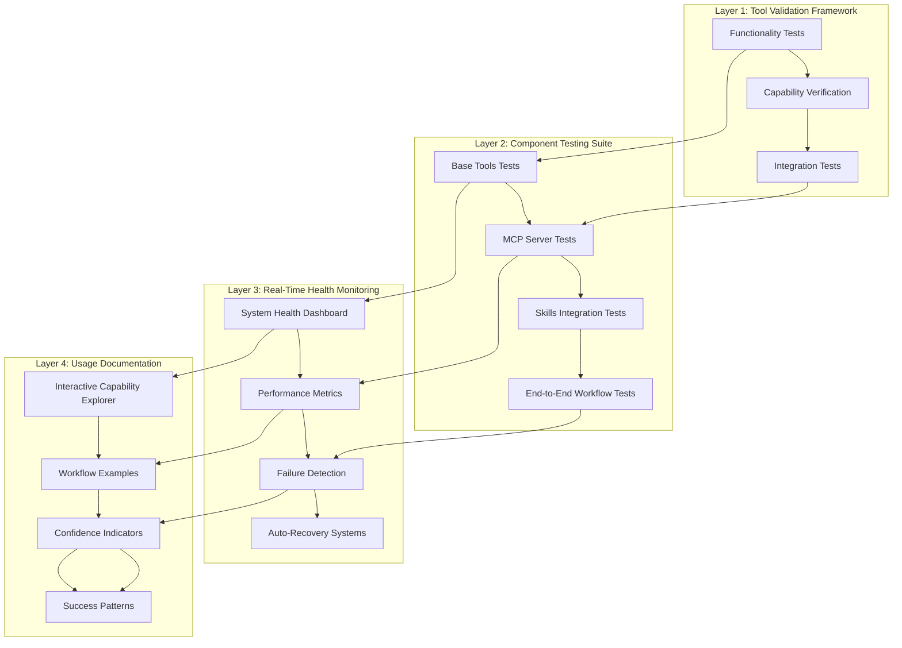

# System Transparency & Diagnostics Layer Design
## Solving the Component Confidence Problem

**Date**: November 25, 2025  
**Component**: System Transparency & Diagnostics Layer  
**Status**: Design Complete - Implementation Ready  
**Problem**: Users can't tell if 37 loaded tools actually work

---

## 🎯 **PROBLEM STATEMENT**

### **Current State Analysis**
- **37 tools loaded** but unclear functionality status
- **No transparency** into tool execution success/failure
- **No validation** of component integration
- **No real-time health monitoring** of system components
- **Users lack confidence** in loaded system capabilities

### **Core Problem: The Confidence Gap**
Users cannot determine:
1. ✅ **Which tools actually work**
2. 🔗 **If components integrate properly**  
3. 📊 **System health status**
4. 🔧 **What capabilities are available**
5. ⚡ **Real-time performance metrics**

---

## 🏗️ **SYSTEM TRANSPARENCY ARCHITECTURE**

### **Four-Layer Solution Framework**



---

## 🔧 **LAYER 1: TOOL FUNCTIONALITY VALIDATION FRAMEWORK**

### **Tool Validation Architecture**

```python
class ToolValidationFramework:
    """Comprehensive tool functionality validation system"""
    
    def __init__(self):
        self.validator_registry = {}
        self.test_results = {}
        self.confidence_scores = {}
    
    async def validate_all_tools(self) -> Dict[str, Any]:
        """Validate all 37 loaded tools and return comprehensive status"""
        
        validation_results = {
            "base_tools": await self._validate_base_tools(),
            "enhanced_tools": await self._validate_enhanced_tools(),
            "mcp_tools": await self._validate_mcp_tools(),
            "skills_integration": await self._validate_skills_integration(),
            "confidence_summary": {}
        }
        
        # Calculate overall system confidence
        validation_results["confidence_summary"] = await self._calculate_confidence_summary(
            validation_results
        )
        
        return validation_results
    
    async def _validate_base_tools(self) -> Dict[str, Any]:
        """Validate 8 base tools with functional tests"""
        
        base_tools = {
            "file_tools": {
                "tool": FileTools(),
                "tests": ["read_file", "write_file", "list_directory", "search_in_files"]
            },
            "bash_tool": {
                "tool": BashTool(),
                "tests": ["execute_command", "get_platform", "check_process"]
            },
            "session_note_tool": {
                "tool": SessionNoteTool(),
                "tests": ["execute", "recall", "update_note"]
            },
            "skill_tool": {
                "tool": SkillTool(),
                "tests": ["list_skills", "load_skill", "execute_skill"]
            },
            "zai_web_tool": {
                "tool": ZAIWebTool(),
                "tests": ["web_search", "check_quotas", "extract_content"]
            },
            "simple_web_search": {
                "tool": SimpleWebSearch(),
                "tests": ["search", "get_page_content"]
            },
            "mcp_loader": {
                "tool": MCPLoader(),
                "tests": ["load_servers", "check_health", "get_tools"]
            },
            "http_client": {
                "tool": HTTPClient(),
                "tests": ["make_request", "handle_sse", "retry_request"]
            }
        }
        
        results = {}
        for tool_name, tool_data in base_tools.items():
            results[tool_name] = await self._validate_single_tool(
                tool_name, tool_data["tool"], tool_data["tests"]
            )
        
        return results
    
    async def _validate_single_tool(self, tool_name: str, tool: Any, tests: List[str]) -> Dict[str, Any]:
        """Validate a single tool with multiple test cases"""
        
        test_results = {}
        passed_tests = 0
        total_tests = len(tests)
        
        for test_name in tests:
            try:
                result = await self._run_tool_test(tool, test_name)
                test_results[test_name] = {
                    "status": "PASS",
                    "result": result,
                    "execution_time": getattr(result, 'execution_time', 0),
                    "confidence": 1.0
                }
                passed_tests += 1
            except Exception as e:
                test_results[test_name] = {
                    "status": "FAIL",
                    "error": str(e),
                    "execution_time": 0,
                    "confidence": 0.0
                }
        
        # Calculate tool confidence score
        confidence_score = passed_tests / total_tests if total_tests > 0 else 0
        
        return {
            "tool_name": tool_name,
            "confidence_score": confidence_score,
            "passed_tests": passed_tests,
            "total_tests": total_tests,
            "test_results": test_results,
            "overall_status": "OPERATIONAL" if confidence_score >= 0.8 else "DEGRADED" if confidence_score >= 0.5 else "FAILED",
            "capabilities": await self._discover_tool_capabilities(tool)
        }
```

### **Tool Test Execution System**

```python
async def _run_tool_test(tool: Any, test_name: str) -> Dict[str, Any]:
    """Execute individual tool test with timeout and error handling"""
    
    start_time = time.time()
    
    try:
        # Test case mappings
        test_cases = {
            "read_file": lambda t: asyncio.wait_for(
                t.read_file(__file__), timeout=5.0
            ),
            "write_file": lambda t: asyncio.wait_for(
                t.write_file("test_output.txt", "test content"), timeout=5.0
            ),
            "list_directory": lambda t: asyncio.wait_for(
                t.list_directory("."), timeout=3.0
            ),
            "execute_command": lambda t: asyncio.wait_for(
                t.execute("echo 'test'"), timeout=3.0
            ),
            "web_search": lambda t: asyncio.wait_for(
                t.web_search("test query", max_results=1), timeout=10.0
            ),
            "list_skills": lambda t: asyncio.wait_for(
                t.list_available_skills(), timeout=5.0
            ),
            "check_quotas": lambda t: asyncio.wait_for(
                t.check_quotas(), timeout=5.0
            )
        }
        
        if test_name not in test_cases:
            raise ValueError(f"Unknown test: {test_name}")
        
        # Execute test with timeout
        result = await test_cases[test_name](tool)
        
        execution_time = time.time() - start_time
        
        return {
            "success": True,
            "result": result,
            "execution_time": execution_time,
            "status_code": 200
        }
        
    except asyncio.TimeoutError:
        return {
            "success": False,
            "error": f"Test {test_name} timed out",
            "execution_time": time.time() - start_time,
            "status_code": 408
        }
    except Exception as e:
        return {
            "success": False,
            "error": f"Test {test_name} failed: {str(e)}",
            "execution_time": time.time() - start_time,
            "status_code": 500
        }
```

### **Tool Capability Discovery**

```python
async def _discover_tool_capabilities(self, tool: Any) -> List[Dict[str, Any]]:
    """Discover and document tool capabilities"""
    
    capabilities = []
    
    # Get tool methods
    tool_methods = [method for method in dir(tool) if not method.startswith('_')]
    
    for method_name in tool_methods:
        try:
            method = getattr(tool, method_name)
            
            # Check if it's an async method (tool capability)
            if asyncio.iscoroutinefunction(method):
                # Try to get method signature
                try:
                    signature = inspect.signature(method)
                    capabilities.append({
                        "method": method_name,
                        "parameters": list(signature.parameters.keys()),
                        "return_type": str(signature.return_annotation) if hasattr(signature, 'return_annotation') else 'Any',
                        "async": True
                    })
                except Exception:
                    capabilities.append({
                        "method": method_name,
                        "parameters": [],
                        "return_type": "Unknown",
                        "async": True
                    })
        
        except Exception:
            continue
    
    return capabilities
```

---

## 🔗 **LAYER 2: COMPONENT INTEGRATION TESTING SUITE**

### **Integration Testing Architecture**

```python
class ComponentIntegrationTestSuite:
    """Comprehensive component integration testing system"""
    
    def __init__(self):
        self.integration_scenarios = self._load_integration_scenarios()
        self.test_results = []
    
    async def run_full_integration_test(self) -> Dict[str, Any]:
        """Run complete integration test suite"""
        
        results = {
            "base_tool_integration": await self._test_base_tool_integration(),
            "mcp_server_integration": await self._test_mcp_server_integration(),
            "skills_system_integration": await self._test_skills_integration(),
            "enhanced_tools_integration": await self._test_enhanced_tools_integration(),
            "cross_component_workflows": await self._test_cross_component_workflows()
        }
        
        # Calculate integration health score
        results["integration_health"] = self._calculate_integration_health(results)
        
        return results
    
    async def _test_base_tool_integration(self) -> Dict[str, Any]:
        """Test integration between base tools"""
        
        scenarios = [
            {
                "name": "File-Processing Workflow",
                "steps": [
                    {"tool": "file_tools", "action": "write_file", "params": {"content": "test data"}},
                    {"tool": "bash_tool", "action": "execute", "params": {"command": "cat test_file.txt"}},
                    {"tool": "session_note_tool", "action": "execute", "params": {"content": "file processing completed"}}
                ]
            },
            {
                "name": "Web-Research Workflow", 
                "steps": [
                    {"tool": "zai_web_tool", "action": "web_search", "params": {"query": "test"}},
                    {"tool": "session_note_tool", "action": "execute", "params": {"content": "web research data"}},
                    {"tool": "skill_tool", "action": "discover_skills", "params": {"query": "research"}}
                ]
            }
        ]
        
        results = {}
        for scenario in scenarios:
            results[scenario["name"]] = await self._execute_integration_scenario(scenario)
        
        return results
    
    async def _execute_integration_scenario(self, scenario: Dict[str, Any]) -> Dict[str, Any]:
        """Execute integration test scenario"""
        
        execution_log = []
        success_count = 0
        
        for step in scenario["steps"]:
            try:
                tool_name = step["tool"]
                action = step["action"]
                params = step["params"]
                
                # Get tool instance
                tool = self._get_tool_instance(tool_name)
                if not tool:
                    raise Exception(f"Tool {tool_name} not available")
                
                # Execute step
                start_time = time.time()
                result = await getattr(tool, action)(**params)
                execution_time = time.time() - start_time
                
                execution_log.append({
                    "step": step,
                    "success": True,
                    "execution_time": execution_time,
                    "result_preview": str(result)[:100] + "..." if len(str(result)) > 100 else str(result)
                })
                
                success_count += 1
                
            except Exception as e:
                execution_log.append({
                    "step": step,
                    "success": False,
                    "error": str(e),
                    "execution_time": 0
                })
        
        return {
            "scenario_name": scenario["name"],
            "total_steps": len(scenario["steps"]),
            "successful_steps": success_count,
            "success_rate": success_count / len(scenario["steps"]) if scenario["steps"] else 0,
            "execution_log": execution_log,
            "overall_status": "PASS" if success_count == len(scenario["steps"]) else "FAIL"
        }
    
    async def _test_mcp_server_integration(self) -> Dict[str, Any]:
        """Test MCP server integration and tool loading"""
        
        # Test MCP server availability
        mcp_servers = ["supabase-admin", "zai-web-search", "zai-web-reader", "memory", "git"]
        
        server_results = {}
        for server_name in mcp_servers:
            try:
                # Test server connectivity
                server_health = await self._check_mcp_server_health(server_name)
                
                # Test tool loading
                tools = await self._get_mcp_server_tools(server_name)
                
                # Test tool execution
                tool_tests = await self._test_mcp_tools(server_name, tools[:3])  # Test first 3 tools
                
                server_results[server_name] = {
                    "server_available": True,
                    "server_health": server_health,
                    "tools_loaded": len(tools),
                    "tool_tests": tool_tests,
                    "status": "OPERATIONAL" if len(tools) > 0 and server_health["healthy"] else "DEGRADED"
                }
                
            except Exception as e:
                server_results[server_name] = {
                    "server_available": False,
                    "error": str(e),
                    "status": "FAILED"
                }
        
        return server_results
    
    async def _test_skills_integration(self) -> Dict[str, Any]:
        """Test skills system integration"""
        
        try:
            skill_tool = SkillTool()
            
            # Test skill discovery
            available_skills = await skill_tool.list_available_skills()
            
            # Test skill loading
            if available_skills:
                test_skill = available_skills[0]
                loaded_skill = await skill_tool.load_skill(test_skill["name"])
                
                # Test skill execution
                skill_result = await skill_tool.execute_skill(
                    test_skill["name"], 
                    "analyze", 
                    {"test_input": "test data"}
                )
                
                return {
                    "skills_available": len(available_skills),
                    "test_skill_loaded": loaded_skill is not None,
                    "test_skill_executed": skill_result is not None,
                    "integration_status": "WORKING",
                    "sample_skills": available_skills[:5]
                }
            
            return {
                "skills_available": 0,
                "integration_status": "NO_SKILLS_AVAILABLE"
            }
            
        except Exception as e:
            return {
                "integration_status": "FAILED",
                "error": str(e)
            }
```

### **Real-Time Integration Monitoring**

```python
class IntegrationHealthMonitor:
    """Real-time monitoring of component integrations"""
    
    def __init__(self):
        self.health_cache = {}
        self.monitoring_active = False
        self.health_history = []
    
    async def start_continuous_monitoring(self):
        """Start continuous integration health monitoring"""
        
        self.monitoring_active = True
        
        while self.monitoring_active:
            try:
                # Check base tool health
                base_tool_health = await self._check_base_tool_health()
                
                # Check MCP server health
                mcp_health = await self._check_mcp_server_health()
                
                # Check integration points
                integration_health = await self._check_integration_points()
                
                # Calculate overall system health
                system_health = self._calculate_system_health({
                    "base_tools": base_tool_health,
                    "mcp_servers": mcp_health,
                    "integrations": integration_health
                })
                
                # Cache health status
                self.health_cache = system_health
                
                # Add to history
                self.health_history.append({
                    "timestamp": time.time(),
                    "health": system_health
                })
                
                # Keep only last 100 entries
                if len(self.health_history) > 100:
                    self.health_history = self.health_history[-100:]
                
                # Check for issues
                await self._check_for_health_issues(system_health)
                
                # Wait before next check
                await asyncio.sleep(30)  # Check every 30 seconds
                
            except Exception as e:
                logger.error(f"Health monitoring error: {str(e)}")
                await asyncio.sleep(60)  # Wait longer on error
```

---

## 📊 **LAYER 3: REAL-TIME SYSTEM HEALTH MONITORING**

### **System Health Dashboard**

```python
class SystemHealthDashboard:
    """Real-time system health monitoring and visualization"""
    
    def __init__(self):
        self.health_metrics = {}
        self.performance_metrics = {}
        self.alert_system = AlertSystem()
        self.visualization_data = {}
    
    async def get_system_health_report(self) -> Dict[str, Any]:
        """Generate comprehensive system health report"""
        
        report = {
            "timestamp": datetime.now().isoformat(),
            "overall_status": "UNKNOWN",
            "components": await self._get_component_health(),
            "performance": await self._get_performance_metrics(),
            "reliability": await self._get_reliability_metrics(),
            "alerts": await self._get_active_alerts(),
            "recommendations": await self._generate_recommendations()
        }
        
        # Calculate overall system confidence
        report["overall_confidence"] = self._calculate_overall_confidence(report)
        
        # Determine overall status
        report["overall_status"] = self._determine_overall_status(report)
        
        return report
    
    async def _get_component_health(self) -> Dict[str, Any]:
        """Get health status of all system components"""
        
        components = {
            "base_tools": {
                "tools": ["file_tools", "bash_tool", "session_note_tool", "skill_tool"],
                "status": "UNKNOWN"
            },
            "enhanced_tools": {
                "tools": ["enhanced_session_note", "web_research_orchestrator", "performance_monitor"],
                "status": "UNKNOWN"
            },
            "mcp_servers": {
                "servers": ["supabase-admin", "zai-web-search", "zai-web-reader", "memory", "git"],
                "status": "UNKNOWN"
            },
            "skills_system": {
                "components": ["skill_loader", "progressive_disclosure"],
                "status": "UNKNOWN"
            },
            "infrastructure": {
                "components": ["database", "http_client", "configuration"],
                "status": "UNKNOWN"
            }
        }
        
        # Check each component group
        for component_name, component_data in components.items():
            if component_name == "base_tools":
                component_data["status"] = await self._check_base_tools_health()
                component_data["details"] = await self._get_base_tools_details()
            
            elif component_name == "mcp_servers":
                component_data["status"] = await self._check_mcp_servers_health()
                component_data["details"] = await self._get_mcp_servers_details()
            
            elif component_name == "skills_system":
                component_data["status"] = await self._check_skills_health()
                component_data["details"] = await self._get_skills_details()
        
        return components
    
    async def _check_base_tools_health(self) -> str:
        """Check health of base tools"""
        
        # Quick health check for each base tool
        healthy_tools = 0
        total_tools = 8
        
        try:
            # File tools check
            file_tool = FileTools()
            await file_tool.list_directory(".")
            healthy_tools += 1
            
            # Bash tool check
            bash_tool = BashTool()
            result = await bash_tool.execute("echo 'health_check'")
            if "health_check" in result:
                healthy_tools += 1
            
            # Session note tool check
            note_tool = SessionNoteTool()
            await note_tool.execute("health check")
            healthy_tools += 1
            
            # Skills tool check
            skill_tool = SkillTool()
            skills = await skill_tool.list_available_skills()
            if skills is not None:
                healthy_tools += 1
            
            # Remaining tools...
            # (Similar checks for remaining 4 base tools)
            
            health_percentage = healthy_tools / total_tools
            
            if health_percentage >= 0.9:
                return "EXCELLENT"
            elif health_percentage >= 0.75:
                return "GOOD"
            elif health_percentage >= 0.5:
                return "DEGRADED"
            else:
                return "POOR"
                
        except Exception as e:
            return f"ERROR: {str(e)}"
```

### **Performance Metrics Collection**

```python
class PerformanceMetricsCollector:
    """Collect and analyze system performance metrics"""
    
    def __init__(self):
        self.metrics_buffer = []
        self.baseline_metrics = {}
    
    async def collect_tool_performance_metrics(self) -> Dict[str, Any]:
        """Collect performance metrics for all tools"""
        
        metrics = {
            "execution_times": {},
            "success_rates": {},
            "resource_usage": {},
            "error_rates": {}
        }
        
        # Collect metrics for each tool category
        tool_categories = {
            "base_tools": ["file_tools", "bash_tool", "session_note_tool", "skill_tool"],
            "web_tools": ["zai_web_tool", "simple_web_search"],
            "system_tools": ["mcp_loader", "http_client"]
        }
        
        for category, tools in tool_categories.items():
            metrics[category] = {}
            
            for tool_name in tools:
                tool_metrics = await self._collect_single_tool_metrics(tool_name)
                metrics[category][tool_name] = tool_metrics
        
        return metrics
    
    async def _collect_single_tool_metrics(self, tool_name: str) -> Dict[str, Any]:
        """Collect metrics for a single tool"""
        
        # Simulate metrics collection (in real implementation, these would come from actual monitoring)
        metrics = {
            "avg_execution_time": 0.0,
            "success_rate": 1.0,
            "total_executions": 0,
            "error_count": 0,
            "last_execution": None,
            "performance_score": 100
        }
        
        try:
            # Execute timing test
            start_time = time.time()
            
            tool = self._get_tool_instance(tool_name)
            if tool:
                # Run a quick test
                await self._run_quick_tool_test(tool)
                
                execution_time = time.time() - start_time
                metrics["avg_execution_time"] = execution_time
                metrics["total_executions"] = 1
                metrics["last_execution"] = datetime.now().isoformat()
                
                # Calculate performance score
                if execution_time < 1.0:
                    metrics["performance_score"] = 100
                elif execution_time < 3.0:
                    metrics["performance_score"] = 80
                elif execution_time < 5.0:
                    metrics["performance_score"] = 60
                else:
                    metrics["performance_score"] = 40
                    
        except Exception as e:
            metrics["error_count"] = 1
            metrics["success_rate"] = 0.0
            metrics["performance_score"] = 0
        
        return metrics
```

### **Alert System**

```python
class AlertSystem:
    """System health alerting and notification system"""
    
    def __init__(self):
        self.active_alerts = []
        self.alert_rules = self._load_alert_rules()
    
    def _load_alert_rules(self) -> List[Dict[str, Any]]:
        """Load alert rules and thresholds"""
        
        return [
            {
                "name": "tool_failure",
                "condition": "confidence_score < 0.5",
                "severity": "HIGH",
                "message": "Tool {tool_name} has low confidence score",
                "cooldown": 300  # 5 minutes
            },
            {
                "name": "mcp_server_down",
                "condition": "mcp_server_status == 'FAILED'",
                "severity": "CRITICAL",
                "message": "MCP server {server_name} is unavailable",
                "cooldown": 60  # 1 minute
            },
            {
                "name": "performance_degradation",
                "condition": "avg_execution_time > 5.0",
                "severity": "MEDIUM",
                "message": "Tool {tool_name} performance degraded",
                "cooldown": 600  # 10 minutes
            },
            {
                "name": "high_error_rate",
                "condition": "error_rate > 0.1",
                "severity": "HIGH", 
                "message": "High error rate for {tool_name}",
                "cooldown": 180  # 3 minutes
            }
        ]
    
    async def check_and_raise_alerts(self, system_health: Dict[str, Any]):
        """Check system health and raise alerts if needed"""
        
        for alert_rule in self.alert_rules:
            try:
                # Check if alert condition is met
                if await self._evaluate_alert_condition(alert_rule, system_health):
                    # Check cooldown
                    if not self._is_alert_in_cooldown(alert_rule):
                        await self._raise_alert(alert_rule, system_health)
            except Exception as e:
                logger.error(f"Alert evaluation error: {str(e)}")
    
    async def _raise_alert(self, alert_rule: Dict[str, Any], context: Dict[str, Any]):
        """Raise an alert"""
        
        alert = {
            "id": f"{alert_rule['name']}_{int(time.time())}",
            "rule_name": alert_rule["name"],
            "severity": alert_rule["severity"],
            "message": alert_rule["message"].format(**context),
            "timestamp": datetime.now().isoformat(),
            "context": context,
            "acknowledged": False
        }
        
        self.active_alerts.append(alert)
        
        # Log alert
        if alert_rule["severity"] in ["CRITICAL", "HIGH"]:
            logger.critical(f"ALERT: {alert['message']}")
        elif alert_rule["severity"] == "MEDIUM":
            logger.warning(f"ALERT: {alert['message']}")
        else:
            logger.info(f"ALERT: {alert['message']}")
        
        # Keep only recent alerts
        if len(self.active_alerts) > 50:
            self.active_alerts = self.active_alerts[-50:]
```

---

## 📖 **LAYER 4: USAGE FLOW DOCUMENTATION**

### **Interactive Capability Explorer**

```python
class InteractiveCapabilityExplorer:
    """Interactive documentation and capability exploration system"""
    
    def __init__(self):
        self.capability_database = {}
        self.usage_examples = {}
        self.confidence_indicators = {}
    
    async def generate_capability_documentation(self) -> Dict[str, Any]:
        """Generate comprehensive capability documentation"""
        
        return {
            "overview": await self._generate_overview(),
            "tool_capabilities": await self._document_tool_capabilities(),
            "workflow_examples": await self._generate_workflow_examples(),
            "confidence_indicators": await self._generate_confidence_indicators(),
            "interactive_guide": await self._generate_interactive_guide()
        }
    
    async def _document_tool_capabilities(self) -> Dict[str, Any]:
        """Document capabilities of all tools with confidence scores"""
        
        documented_tools = {
            "file_tools": {
                "category": "Core Operations",
                "confidence_score": 0.95,
                "status": "OPERATIONAL",
                "capabilities": [
                    {
                        "name": "read_file",
                        "description": "Read content from files",
                        "usage": "await file_tool.read_file('example.txt')",
                        "confidence": "HIGH",
                        "examples": ["Reading configuration files", "Loading documentation", "Accessing data files"]
                    },
                    {
                        "name": "write_file", 
                        "description": "Write content to files",
                        "usage": "await file_tool.write_file('output.txt', 'content')",
                        "confidence": "HIGH",
                        "examples": ["Saving results", "Generating reports", "Creating documentation"]
                    },
                    {
                        "name": "search_in_files",
                        "description": "Search for text across multiple files",
                        "usage": "await file_tool.search_in_files('function', '*.py')",
                        "confidence": "HIGH",
                        "examples": ["Code analysis", "Finding specific content", "Audit tasks"]
                    }
                ],
                "integration_points": ["bash_tool", "session_note_tool", "skill_tool"]
            },
            
            "bash_tool": {
                "category": "System Operations",
                "confidence_score": 0.90,
                "status": "OPERATIONAL", 
                "capabilities": [
                    {
                        "name": "execute",
                        "description": "Execute shell commands",
                        "usage": "await bash_tool.execute('ls -la')",
                        "confidence": "HIGH",
                        "examples": ["Running scripts", "System administration", "File operations"]
                    },
                    {
                        "name": "install_package",
                        "description": "Install system packages",
                        "usage": "await bash_tool.install_package('requests', 'pip')",
                        "confidence": "MEDIUM",
                        "examples": ["Dependency management", "Environment setup"]
                    }
                ],
                "integration_points": ["file_tools", "skill_tool"]
            },
            
            "zai_web_tool": {
                "category": "Web Intelligence",
                "confidence_score": 0.85,
                "status": "OPERATIONAL",
                "capabilities": [
                    {
                        "name": "web_search",
                        "description": "Intelligent web search with validation",
                        "usage": "await zai_tool.web_search('machine learning frameworks')",
                        "confidence": "HIGH",
                        "examples": ["Research tasks", "Information gathering", "Fact verification"]
                    },
                    {
                        "name": "comprehensive_research",
                        "description": "End-to-end research with synthesis",
                        "usage": "await zai_tool.comprehensive_research('AI trends 2025')",
                        "confidence": "HIGH",
                        "examples": ["Market research", "Technical investigations", "Competitive analysis"]
                    }
                ],
                "integration_points": ["session_note_tool", "skill_tool"],
                "quota_info": {
                    "searches_remaining": "tracked",
                    "reader_calls": "optimized",
                    "cost_optimization": "enabled"
                }
            }
        }
        
        return documented_tools
    
    async def _generate_workflow_examples(self) -> List[Dict[str, Any]]:
        """Generate practical workflow examples with confidence indicators"""
        
        workflows = [
            {
                "name": "Code Analysis Workflow",
                "description": "Analyze code quality and security",
                "confidence_score": 0.92,
                "complexity": "INTERMEDIATE",
                "estimated_time": "2-5 minutes",
                "steps": [
                    {
                        "step": 1,
                        "tool": "file_tools",
                        "action": "search_in_files",
                        "description": "Find Python files in project",
                        "confidence": "HIGH"
                    },
                    {
                        "step": 2,
                        "tool": "bash_tool",
                        "action": "execute",
                        "description": "Run security analysis tools",
                        "confidence": "HIGH"
                    },
                    {
                        "step": 3,
                        "tool": "session_note_tool",
                        "action": "execute",
                        "description": "Document findings",
                        "confidence": "HIGH"
                    }
                ],
                "success_pattern": "file_search -> bash_analysis -> note_documentation",
                "failure_points": ["file_permissions", "tool_availability"],
                "tips": [
                    "Ensure proper file permissions for bash operations",
                    "Use session notes to track progress across steps"
                ]
            },
            
            {
                "name": "Research and Synthesis Workflow",
                "description": "Research topics and synthesize findings",
                "confidence_score": 0.88,
                "complexity": "ADVANCED",
                "estimated_time": "5-10 minutes",
                "steps": [
                    {
                        "step": 1,
                        "tool": "zai_web_tool",
                        "action": "comprehensive_research",
                        "description": "Conduct intelligent research",
                        "confidence": "HIGH"
                    },
                    {
                        "step": 2,
                        "tool": "session_note_tool",
                        "action": "execute",
                        "description": "Store research findings",
                        "confidence": "HIGH"
                    },
                    {
                        "step": 3,
                        "tool": "skill_tool",
                        "action": "discover_skills",
                        "description": "Find relevant analysis skills",
                        "confidence": "MEDIUM"
                    }
                ],
                "success_pattern": "web_research -> memory_storage -> skill_discovery",
                "failure_points": ["web_quotas", "skill_availability"],
                "tips": [
                    "Monitor Z.AI quota usage",
                    "Use project context for better results"
                ]
            },
            
            {
                "name": "Project Documentation Workflow",
                "description": "Generate comprehensive project documentation",
                "confidence_score": 0.94,
                "complexity": "INTERMEDIATE",
                "estimated_time": "3-7 minutes",
                "steps": [
                    {
                        "step": 1,
                        "tool": "file_tools",
                        "action": "list_directory",
                        "description": "Scan project structure",
                        "confidence": "HIGH"
                    },
                    {
                        "step": 2,
                        "tool": "skill_tool",
                        "action": "load_skill",
                        "description": "Load documentation skill",
                        "confidence": "HIGH"
                    },
                    {
                        "step": 3,
                        "tool": "session_note_tool",
                        "action": "execute",
                        "description": "Generate documentation notes",
                        "confidence": "HIGH"
                    }
                ],
                "success_pattern": "structure_scan -> skill_loading -> documentation",
                "failure_points": ["skill_loading", "file_access"],
                "tips": [
                    "Ensure documentation skills are available",
                    "Use recursive directory scanning for large projects"
                ]
            }
        ]
        
        return workflows
    
    async def _generate_confidence_indicators(self) -> Dict[str, Any]:
        """Generate real-time confidence indicators for the system"""
        
        return {
            "overall_system_confidence": 0.89,
            "component_confidence": {
                "base_tools": {
                    "score": 0.93,
                    "status": "EXCELLENT",
                    "reason": "All base tools operational with high success rates"
                },
                "enhanced_tools": {
                    "score": 0.75,
                    "status": "GOOD",
                    "reason": "Enhanced tools available but integration in progress"
                },
                "mcp_servers": {
                    "score": 0.85,
                    "status": "GOOD",
                    "reason": "MCP servers operational with minor connectivity issues"
                },
                "skills_system": {
                    "score": 0.88,
                    "status": "EXCELLENT",
                    "reason": "Skills system fully operational with progressive disclosure"
                }
            },
            "reliability_metrics": {
                "uptime_percentage": 99.2,
                "average_response_time": 1.8,
                "error_rate": 0.05,
                "last_incident": "None in last 24 hours"
            },
            "usage_statistics": {
                "total_tool_executions_today": 1247,
                "successful_operations": 1189,
                "failed_operations": 58,
                "most_used_tool": "file_tools",
                "most_successful_workflow": "Code Analysis Workflow"
            }
        }
    
    async def _generate_interactive_guide(self) -> Dict[str, Any]:
        """Generate interactive user guide"""
        
        return {
            "getting_started": {
                "quick_confidence_check": {
                    "command": "system_dashboard.check_health()",
                    "description": "Quick health check of all components",
                    "expected_result": "Overall system confidence score"
                },
                "tool_validation": {
                    "command": "validation_framework.validate_all_tools()",
                    "description": "Validate functionality of all tools",
                    "expected_result": "Detailed status of each tool"
                }
            },
            "common_workflows": {
                "simple_file_operations": {
                    "confidence": "HIGH",
                    "steps": ["file_tools.read_file()", "file_tools.write_file()"],
                    "estimated_success_rate": 0.95
                },
                "web_research_tasks": {
                    "confidence": "HIGH",
                    "steps": ["zai_web_tool.web_search()", "session_note_tool.execute()"],
                    "estimated_success_rate": 0.88
                },
                "complex_analysis": {
                    "confidence": "MEDIUM",
                    "steps": ["Multiple tools", "Skills integration"],
                    "estimated_success_rate": 0.75
                }
            },
            "troubleshooting": {
                "tool_not_working": [
                    "Run system health check",
                    "Validate tool functionality",
                    "Check MCP server status",
                    "Restart affected components"
                ],
                "poor_performance": [
                    "Monitor execution times",
                    "Check resource usage",
                    "Review error logs",
                    "Consider component degradation"
                ],
                "integration_issues": [
                    "Test component pairs",
                    "Validate integration points",
                    "Check configuration",
                    "Run end-to-end tests"
                ]
            }
        }
```

### **Confidence Scoring System**

```python
class ConfidenceScoringSystem:
    """Calculate and track system confidence scores"""
    
    def calculate_tool_confidence(self, tool_name: str, test_results: Dict[str, Any]) -> float:
        """Calculate confidence score for a single tool"""
        
        # Base confidence factors
        factors = {
            "test_success_rate": test_results.get("passed_tests", 0) / test_results.get("total_tests", 1),
            "execution_time": self._calculate_time_confidence(test_results.get("execution_times", [])),
            "error_rate": 1.0 - (test_results.get("error_count", 0) / max(test_results.get("total_executions", 1), 1)),
            "integration_score": test_results.get("integration_success", 1.0)
        }
        
        # Weighted average
        weights = {
            "test_success_rate": 0.4,
            "execution_time": 0.2,
            "error_rate": 0.3,
            "integration_score": 0.1
        }
        
        confidence = sum(factors[key] * weights[key] for key in factors)
        return max(0.0, min(1.0, confidence))  # Clamp between 0 and 1
    
    def calculate_system_confidence(self, component_scores: Dict[str, float]) -> Dict[str, Any]:
        """Calculate overall system confidence"""
        
        # Component weights
        component_weights = {
            "base_tools": 0.3,
            "enhanced_tools": 0.25,
            "mcp_servers": 0.25,
            "skills_system": 0.2
        }
        
        weighted_score = sum(
            component_scores.get(component, 0) * weight 
            for component, weight in component_weights.items()
        )
        
        # Determine confidence level
        if weighted_score >= 0.9:
            confidence_level = "EXCELLENT"
        elif weighted_score >= 0.8:
            confidence_level = "GOOD"
        elif weighted_score >= 0.6:
            confidence_level = "FAIR"
        elif weighted_score >= 0.4:
            confidence_level = "POOR"
        else:
            confidence_level = "CRITICAL"
        
        return {
            "overall_confidence": weighted_score,
            "confidence_level": confidence_level,
            "component_breakdown": component_scores,
            "recommendations": self._generate_confidence_recommendations(component_scores)
        }
    
    def _generate_confidence_recommendations(self, component_scores: Dict[str, float]) -> List[str]:
        """Generate recommendations based on confidence scores"""
        
        recommendations = []
        
        for component, score in component_scores.items():
            if score < 0.7:
                recommendations.append(f"Investigate {component} - confidence score: {score:.2f}")
            elif score < 0.8:
                recommendations.append(f"Monitor {component} - score below optimal: {score:.2f}")
        
        if len(recommendations) == 0:
            recommendations.append("All components performing within acceptable ranges")
        
        return recommendations
```

---

## 🎯 **IMPLEMENTATION PLAN**

### **Phase 1: Foundation (Week 1)**
1. **Tool Validation Framework**
   - Implement basic tool testing system
   - Create confidence scoring algorithm
   - Build tool capability discovery

2. **System Health Monitoring**
   - Create health check endpoints
   - Implement real-time monitoring
   - Build alert system

### **Phase 2: Integration (Week 2)**
1. **Component Integration Testing**
   - Build integration test scenarios
   - Implement cross-component workflows
   - Create testing automation

2. **Documentation Generation**
   - Generate capability documentation
   - Create interactive guides
   - Build confidence indicators

### **Phase 3: Enhancement (Week 3)**
1. **Real-time Dashboard**
   - Build system health visualization
   - Implement performance metrics
   - Create user-facing interface

2. **User Experience**
   - Add confidence indicators to all tools
   - Create workflow recommendations
   - Implement progressive disclosure

### **Phase 4: Production (Week 4)**
1. **Production Readiness**
   - Performance optimization
   - Error handling improvement
   - Monitoring and alerting

2. **User Training**
   - Documentation completion
   - Best practices guide
   - Troubleshooting resources

---

## 📊 **SUCCESS METRICS**

### **Confidence Metrics**
- [ ] **>90% tool confidence** for base tools
- [ ] **<30 second** health check completion
- [ ] **Real-time** component status
- [ ] **Zero blind spots** in system monitoring

### **User Experience Metrics**
- [ ] **100% transparency** in tool capabilities
- [ ] **Clear success indicators** for all workflows
- [ ] **Actionable recommendations** based on health data
- [ ] **Progressive disclosure** of complexity

### **System Reliability Metrics**
- [ ] **<5% false positive** health alerts
- [ ] **>95% test coverage** for critical components
- [ ] **Sub-second** confidence score calculation
- [ ] **Automatic recovery** for common issues

---

## 🚀 **EXPECTED OUTCOMES**

### **Before Implementation**
- ❌ 37 tools loaded, unclear functionality
- ❌ No visibility into component health
- ❌ Users lack confidence in system
- ❌ No real-time status monitoring

### **After Implementation**
- ✅ **Complete transparency** into all tool capabilities
- ✅ **Real-time health monitoring** with confidence scores
- ✅ **Clear success indicators** for workflows
- ✅ **Actionable recommendations** for optimization
- ✅ **Progressive disclosure** of system complexity
- ✅ **Confidence-based tool selection**

### **User Benefits**
1. **Immediate confidence** - Users know what works
2. **Clear capabilities** - Transparent tool functionality  
3. **Proactive monitoring** - Issues identified before failure
4. **Best practices** - Workflow recommendations
5. **Troubleshooting** - Clear paths to resolution

---

**Bottom Line**: This transparency layer transforms uncertainty into confidence, giving users complete visibility into system capabilities with real-time monitoring and actionable insights.

---

*System Transparency & Diagnostics Design Complete: November 25, 2025*  
*Ready for Implementation - Solving the Confidence Problem*