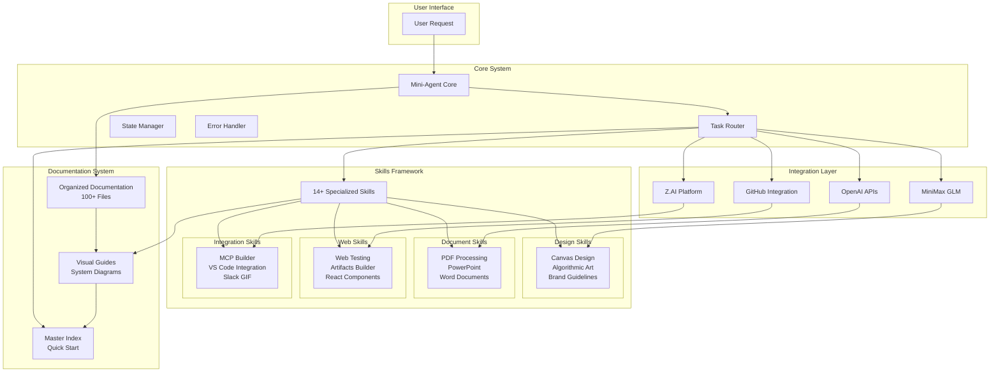
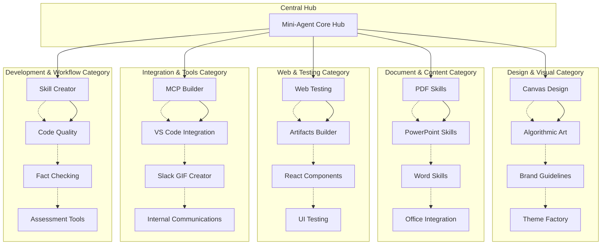
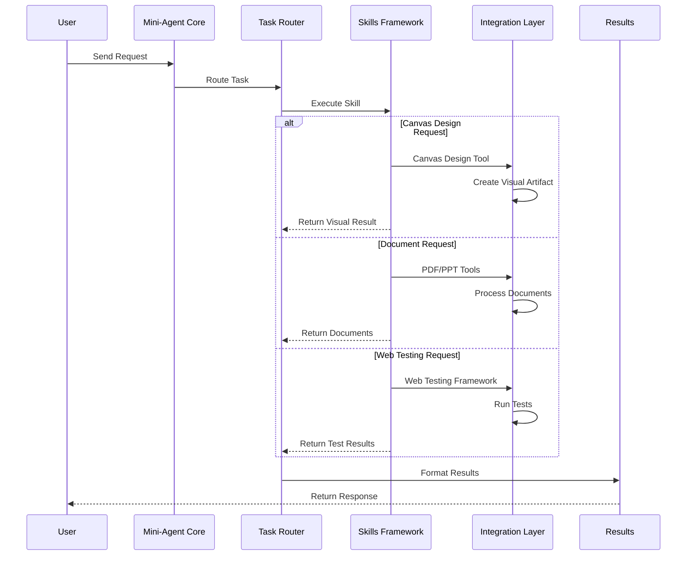
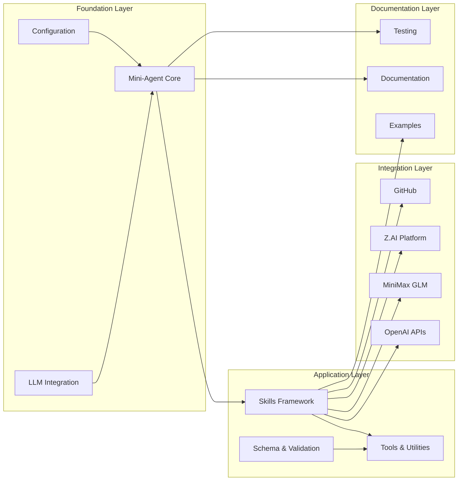
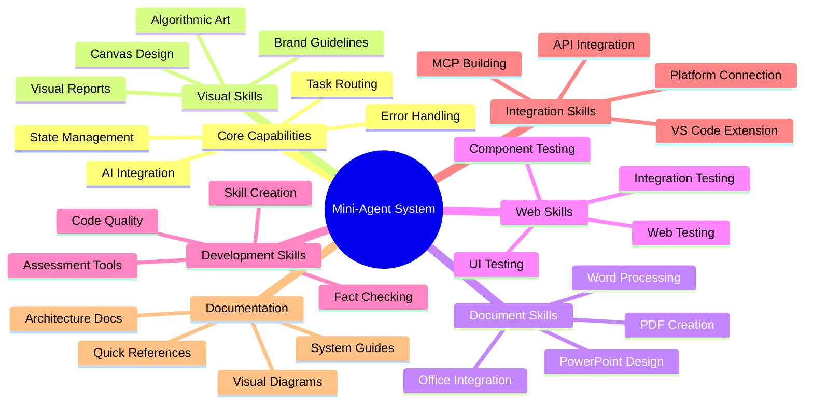
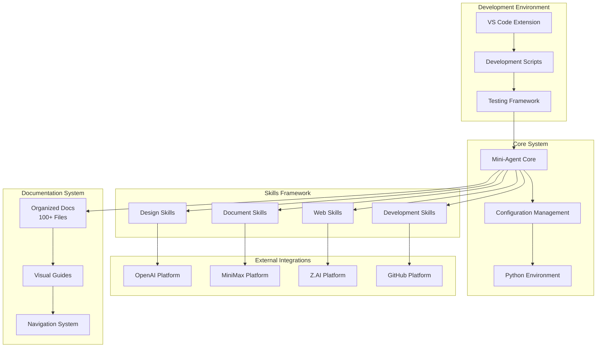

# 🔄 Mini-Agent System - Mermaid Diagram Visualizations

## 1. **System Architecture Flowchart**

## 2. **Skills Network Relationship Diagram**

## 3. **Data Flow Sequence Diagram**

## 4. **Component Dependency Diagram**

## 5. **System Capabilities Mind Map**

## 6. **Deployment Architecture Diagram**

## 💡 **Mermaid Usage Benefits**
- ✅ **GitHub Compatible** - Renders in GitHub/VS Code
- ✅ **Version Controlled** - Text-based, easy to maintain
- ✅ **Interactive** - Clickable elements, zoom, pan
- ✅ **Professional** - Clean, technical documentation
- ✅ **Multiple Types** - Flowcharts, sequence, mind maps
