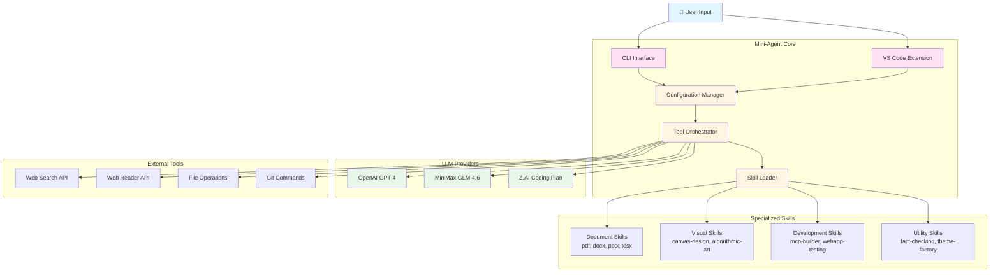
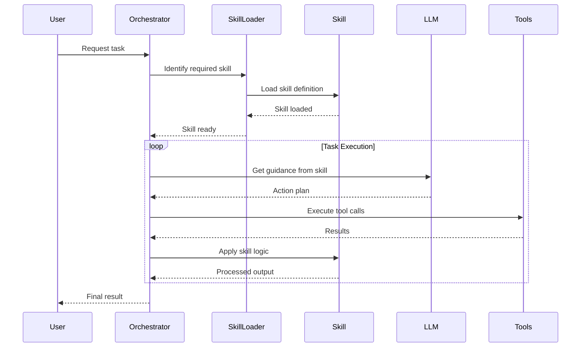
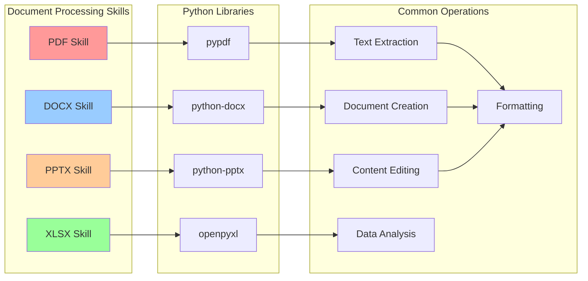
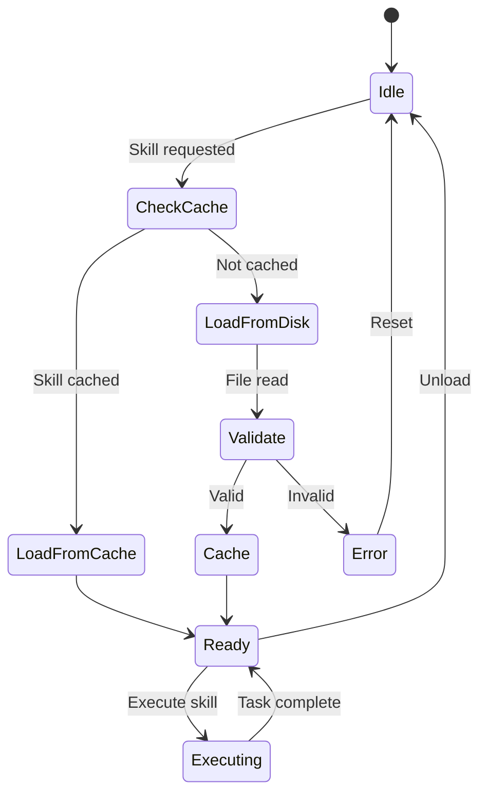
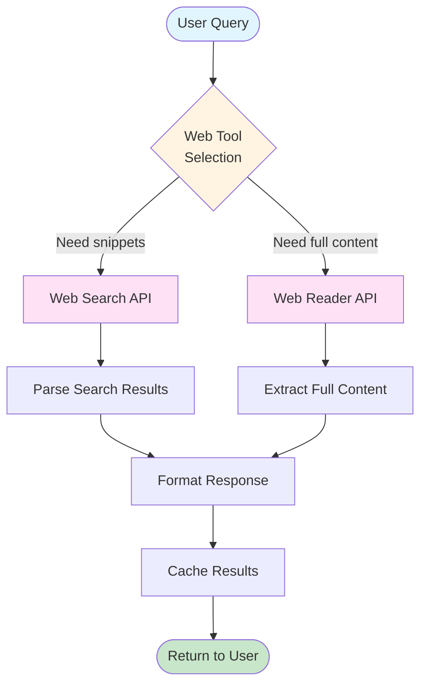
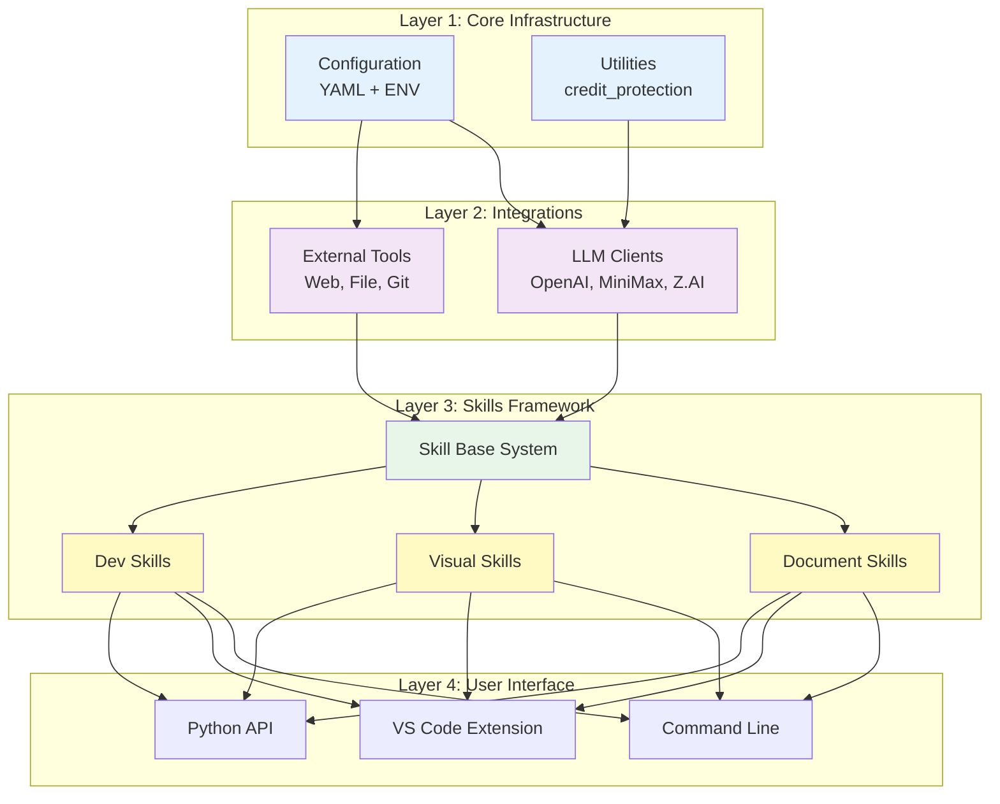
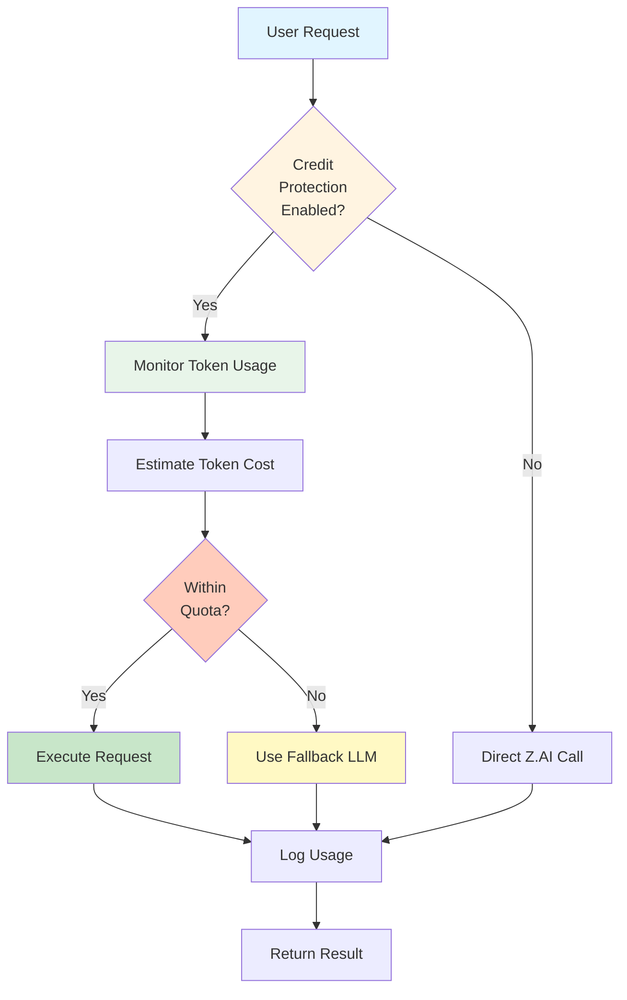

# 🔄 Mermaid Interactive Diagrams - Mini-Agent System

These diagrams render natively in GitHub, VS Code, and many markdown viewers.

## System Architecture Overview

## Skill Execution Flow

## Document Skill Architecture

## State Machine - Skill Loading

## Data Flow - Web Search Integration

## Component Dependency Graph

## Z.AI Credit Protection System

---

## How to Use These Diagrams

1. **GitHub**: Commit this file - diagrams render automatically
2. **VS Code**: Install "Markdown Preview Mermaid Support" extension
3. **Standalone**: Use [Mermaid Live Editor](https://mermaid.live)
4. **Export**: Most viewers support exporting to SVG/PNG

## Diagram Legend

| Color | Meaning |
|-------|---------|
| 🔵 Blue | User interaction points |
| 🟣 Purple | Core system components |
| 🟢 Green | LLM providers / execution |
| 🟡 Yellow | Skills and specialized modules |
| 🔴 Orange | Decision points / validation |

---

*These interactive diagrams update automatically when viewed in compatible markdown renderers.*
*Best viewed in: GitHub, VS Code with Mermaid extension, or mermaid.live*
