# Mermaid Interactive System Diagram

## Flowchart: System Architecture

```mermaid
flowchart TD
    USER[👤 User Input] --> ROUTER[🧠 Skill Router]
    
    ROUTER --> DOC[📄 Document Skills]
    ROUTER --> WEB[🌐 Web & Testing Skills]
    ROUTER --> CREATIVE[🎨 Creative Skills]
    ROUTER --> DEV[🛠️ Development Skills]
    ROUTER --> QUALITY[✅ Quality Skills]
    ROUTER --> BRAND[🎯 Template & Branding]
    ROUTER --> UTIL[🔧 Utility Skills]
    
    DOC --> DOX[📝 DOCX Skill]
    DOC --> PDF[📄 PDF Skill]
    DOC --> PPT[📊 PPTX Skill]
    DOC --> XLS[📈 XLSX Skill]
    
    WEB --> WEBTEST[🧪 WebApp Testing]
    WEB --> SEARCH[🔍 Search & API]
    
    CREATIVE --> CANVAS[🎨 Canvas Design]
    CREATIVE --> ART[🎯 Algorithmic Art]
    
    DEV --> MCP[🔗 MCP Builder]
    DEV --> SKILL[⚙️ Skill Creator]
    
    QUALITY --> FACT[🔍 Fact Checking]
    QUALITY --> ASSESS[📊 Self Assessment]
    
    BRAND --> BRAND_GUIDE[📐 Brand Guidelines]
    BRAND --> THEME[🎨 Theme Factory]
    
    UTIL --> SLACK[💬 Slack GIF]
    UTIL --> TEMPLATE[📋 Template Skill]
    UTIL --> VSCODE[💻 VS Code Integration]
    
    DOX --> DOCS[(📁 Documents)]
    PDF --> DOCS
    PPT --> DOCS
    XLS --> DOCS
    CANVAS --> DOCS
    ART --> DOCS
    MCP --> MINIA[(🔧 Mini-Agent Framework)]
    SKILL --> MINIA
    FACT --> QUALITY_OUT[(✅ Quality Output)]
    ASSESS --> QUALITY_OUT
    
    DOCS --> OUTPUT[📤 Final Output]
    QUALITY_OUT --> OUTPUT
    
    style USER fill:#e1f5fe
    style ROUTER fill:#f3e5f5
    style DOCS fill:#e8f5e8
    style OUTPUT fill:#fff3e0
```

## Class Diagram: Skills Framework

## Sequence Diagram: Document Processing Flow

## System Architecture Timeline

## Network Diagram: Skills Interconnections

```mermaid
graph LR
    subgraph "Document Processing"
        DOCX[📝 DOCX]
        PDF[📄 PDF]
        PPTX[📊 PPTX]
        XLSX[📈 XLSX]
    end
    
    subgraph "Creative Tools"
        CANVAS[🎨 Canvas Design]
        ART[🎯 Algorithmic Art]
    end
    
    subgraph "Quality Assurance"
        FACT[🔍 Fact Check]
        ASSESS[📊 Assessment]
    end
    
    subgraph "Integration Layer"
        MCP[🔗 MCP Builder]
        VSCODE[💻 VS Code]
        THEME[🎨 Theme Factory]
    end
    
    DOCX -.-> CANVAS
    PDF -.-> ART
    PPTX -.-> CANVAS
    XLSX -.-> FACT
    CANVAS -.-> THEME
    ART -.-> THEME
    MCP -.-> VSCODE
    
    style CANVAS fill:#ff9999
    style ART fill:#99ccff
    style THEME fill:#99ff99
    style MCP fill:#ffcc99
    style VSCODE fill:#cc99ff
```

