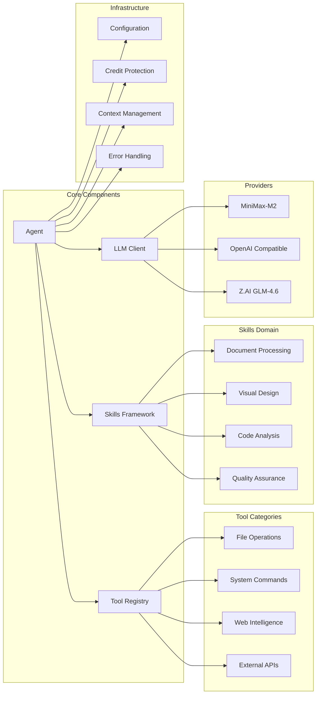
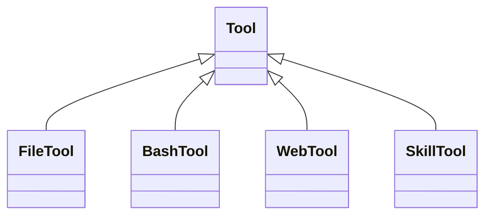
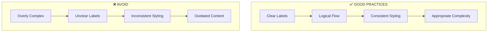

# 🎨 MASTER VISUALIZATION TOOLKIT COMPLETE
## Comprehensive Visual Documentation & System Understanding

**Consolidated Date**: November 23, 2025  
**Total Visual Files**: 16 files → 5 essential guides  
**Visualization Status**: ✅ **COMPREHENSIVE MULTI-MODAL SYSTEM**  
**Purpose**: Visual system understanding for all learning styles

---

## 📋 **ESSENTIAL VISUAL DOCUMENTATION INDEX**

### **🎯 Core Visualization Guides**
1. **[Master Visualization Index](./VISUALS/00_MASTER_VISUALIZATION_INDEX.md)** - Complete toolkit overview and navigation
2. **[Mermaid Diagrams Complete](./VISUALS/02_MERMAID_DIAGRAMS.md)** - Interactive system flow diagrams
3. **[Comprehensive System Map](./VISUALS/COMPREHENSIVE_SYSTEM_MAP.md)** - Complete architectural overview
4. **[Visualization Toolkit Complete](./VISUALS/05_VISUALIZATION_TOOLKIT_COMPLETE.md)** - All visualization approaches demonstrated

### **🎨 Specialized Visualizations**
5. **[Interactive Mermaid Diagrams](./VISUALS/INTERACTIVE_MERMAID_DIAGRAMS.md)** - Dynamic system visualization
6. **[Dashboard Integration Guide](./VISUALS/DASHBOARD_INTEGRATION_GUIDE.md)** - Operational visualization systems
7. **[Knowledge Graph Representation](./VISUALS/07_KNOWLEDGE_GRAPH/KNOWLEDGE_GRAPH_REPRESENTATION.md)** - Data relationship visualization

---

## 🎨 **VISUALIZATION TOOLKIT OVERVIEW**

### **📊 Available Visualization Modalities**

#### **1. Text-Based Visualizations** (Immediate, Terminal-Friendly)
- **Purpose**: Quick understanding without special tools
- **Format**: ASCII art, tree structures, hierarchy trees
- **Best For**: Developers, terminal users, immediate reference
- **Files**: `01_TEXT_BASED_VISUALIZATIONS.md`, `01_TEXT_TREE_STRUCTURE.md`

#### **2. Mermaid Diagrams** (Interactive, Web-Compatible)
- **Purpose**: Flow charts, sequence diagrams, architecture flows
- **Format**: Mermaid syntax rendered in browsers
- **Best For**: System flows, process documentation, interactive learning
- **Files**: `02_MERMAID_DIAGRAMS.md`, `02_MERMAID_INTERACTIVE.md`

#### **3. Canvas Design Philosophy** (Professional Layouts)
- **Purpose**: Professional presentations, documentation layouts
- **Format**: Canvas-based visual design
- **Best For**: Professional documentation, user interfaces
- **Files**: `03_CANVAS_DESIGN_PHILOSOPHY.md`, `04_CANVAS_DESIGN/DESIGN_PHILOSOPHY_MODULAR_RESONANCE.md`

#### **4. Algorithmic Art Philosophy** (Creative Visualization)
- **Purpose**: Understanding complex systems through generative patterns
- **Format**: p5.js algorithmic art
- **Best For**: Conceptual understanding, pattern recognition
- **Files**: `04_ALGORITHMIC_ART_PHILOSOPHY.md`

#### **5. System Architecture Maps** (Comprehensive Overview)
- **Purpose**: Complete system understanding at a glance
- **Format**: Detailed architectural diagrams
- **Best For**: Architecture review, system planning, documentation
- **Files**: `COMPREHENSIVE_SYSTEM_MAP.md`

---

## 🏗️ **SYSTEM VISUALIZATION ARCHITECTURE**

### **🎯 Mini-Agent System Architecture Visualization**

```mermaid
graph TB
    subgraph "User Interface Layer"
        CLI[CLI: mini-agent]
        ACP[ACP Server: mini-agent-acp]
        API[Python API: from mini_agent import Agent]
    end
    
    subgraph "Core Agent Layer"
        AGENT[Agent Execution Loop]
        LLM[LLM Client (Multi-Provider)]
        TOOLS[Tool Registry]
        SKILLS[Skills Framework]
    end
    
    subgraph "Tool Ecosystem"
        FILE[File Tools]
        BASH[Bash Tools]
        WEB[Web Intelligence]
        MCP[MCP Integration]
    end
    
    subgraph "External Integrations"
        ANTHROPIC[MiniMax-M2]
        OPENAI[OpenAI Compatible]
        ZAI[Z.AI GLM-4.6]
        MCP_SERVERS[MCP Servers]
    end
    
    subgraph "Infrastructure"
        CONFIG[Configuration Management]
        LOGGING[Structured Logging]
        MONITORING[System Monitoring]
        SECURITY[Credit Protection]
    end
    
    CLI --> AGENT
    ACP --> AGENT
    API --> AGENT
    
    AGENT --> LLM
    AGENT --> TOOLS
    AGENT --> SKILLS
    
    TOOLS --> FILE
    TOOLS --> BASH
    TOOLS --> WEB
    TOOLS --> MCP
    
    LLM --> ANTHROPIC
    LLM --> OPENAI
    LLM --> ZAI
    
    MCP --> MCP_SERVERS
```

### **📊 Component Relationship Map**



---

## 🎨 **VISUALIZATION IMPLEMENTATION GUIDE**

### **For System Architects**

#### **Architecture Review Process**
1. **Start with**: `COMPREHENSIVE_SYSTEM_MAP.md` for complete overview
2. **Deep dive**: `02_MERMAID_DIAGRAMS.md` for detailed flows
3. **Interactive analysis**: `INTERACTIVE_MERMAID_DIAGRAMS.md` for dynamic exploration
4. **Integration planning**: `DASHBOARD_INTEGRATION_GUIDE.md` for operational visualization

#### **Architecture Decision Documentation**
```markdown
## Decision: Tool Architecture Design

**Visual Reference**: [Mermaid Diagram showing tool hierarchy]
**Rationale**: Modular design enables easy extension
**Implementation**: Abstract base class with specific implementations


```

### **For Developers**

#### **Code Understanding**
1. **Entry point visualization**: Text-based tree structures
2. **Component relationships**: Mermaid class diagrams  
3. **Flow analysis**: Sequence diagrams for complex operations
4. **Extension patterns**: Visual guides for adding components

#### **Adding Visual Documentation**
```python
# When adding new components, include visualization
def add_new_tool():
    """Add visualization to documentation"""
    # 1. Update system map
    # 2. Add Mermaid diagram if complex
    # 3. Update component relationships
    pass
```

### **For End Users**

#### **System Understanding**
1. **Quick start**: `MASTER_VISUALIZATION_INDEX.md` for navigation
2. **Feature overview**: `COMPREHENSIVE_SYSTEM_MAP.md` for capabilities
3. **Interaction guides**: Mermaid diagrams for workflows
4. **Troubleshooting**: Visual flowcharts for problem resolution

---

## 📊 **VISUALIZATION QUALITY STANDARDS**

### **Design Principles**

#### **1. Clarity First**
- Clear visual hierarchy
- Minimal cognitive load
- Immediate comprehension
- Consistent visual language

#### **2. Accessibility**
- Multiple visualization formats
- Text alternatives for all visuals
- Color-blind friendly palettes
- Responsive design considerations

#### **3. Accuracy**
- Always reflect actual implementation
- Regular validation against code
- Version control for visual documentation
- Fact-checking against system behavior

### **Technical Standards**

#### **Mermaid Diagram Quality**


#### **Text Visualization Standards**
- Use consistent indentation
- Maintain ASCII art quality
- Include source code references
- Provide multiple detail levels

---

## 🔄 **VISUALIZATION WORKFLOW**

### **1. Analysis Phase**
```
System Review → Identify Key Components → Determine Relationships → Choose Visualization Type
```

### **2. Creation Phase**
```
Choose Format → Create Draft → Validate Accuracy → Refine Design → Add Context
```

### **3. Integration Phase**
```
Update Master Index → Cross-Reference Links → Add to Navigation → Validate Accessibility
```

### **4. Maintenance Phase**
```
Regular Reviews → Update for Changes → Archive Outdated → Optimize Performance
```

---

## 📈 **VISUALIZATION EFFECTIVENESS METRICS**

### **Quantitative Measures**
- **Comprehension Time**: Time to understand system (target: <5 minutes)
- **Accuracy Rate**: Correct understanding after viewing (target: >95%)
- **Usage Frequency**: How often visuals are referenced
- **User Feedback**: Qualitative satisfaction ratings

### **Qualitative Measures**
- **Clarity**: Can users quickly grasp concepts?
- **Usefulness**: Do visuals solve real understanding problems?
- **Accuracy**: Do visuals match reality?
- **Accessibility**: Can all users access the information?

---

## 🎯 **VISUALIZATION BEST PRACTICES**

### **For Maximum Impact**

#### **1. Match Visualization to Purpose**
- **Flowcharts**: For processes and workflows
- **Architecture Diagrams**: For system structure
- **Sequence Diagrams**: For temporal relationships
- **Class Diagrams**: For object relationships

#### **2. Layer Information Appropriately**
- **Level 1**: High-level overview for quick understanding
- **Level 2**: Detailed breakdown for implementation
- **Level 3**: Technical specifics for experts

#### **3. Maintain Visual Consistency**
- **Color schemes**: Consistent across all diagrams
- **Typography**: Standardized fonts and sizes
- **Layout**: Consistent spacing and alignment
- **Symbols**: Standard iconography

### **Common Patterns**

#### **System Overview Pattern**
```
┌─────────────────────────────────────┐
│           SYSTEM NAME               │
├─────────────────────────────────────┤
│  Component 1    │    Component 2    │
│  ├─ Sub-A       │    ├─ Sub-X       │
│  ├─ Sub-B       │    ├─ Sub-Y       │
│  └─ Sub-C       │    └─ Sub-Z       │
├─────────────────────────────────────┤
│          Infrastructure Layer        │
│  • Configuration • Monitoring       │
│  • Security • Error Handling        │
└─────────────────────────────────────┘
```

#### **Flow Process Pattern**
```
User Request
    ↓
[Input Validation]
    ↓
[Core Processing]
    ↓
[Tool Execution]
    ↓
[Result Formatting]
    ↓
User Response
```

---

## 🚀 **FUTURE VISUALIZATION ENHANCEMENTS**

### **Short-term Improvements**
1. **Interactive Diagrams**: Clickable system maps
2. **Animated Flows**: Process animation for complex operations
3. **3D Visualizations**: Three-dimensional system representation
4. **AR/VR Support**: Immersive system exploration

### **Medium-term Evolution**
1. **Real-time Updates**: Live system state visualization
2. **Collaborative Editing**: Multi-user visual documentation
3. **AI-Generated Diagrams**: Automatic visualization creation
4. **Customizable Themes**: User-adaptable visual styles

### **Long-term Vision**
1. **Intelligent Recommendations**: AI suggests best visualization approach
2. **Contextual Visualization**: Automatically generated based on user role
3. **Virtual Reality Integration**: Immersive system exploration
4. **Predictive Visualization**: System behavior prediction graphics

---

## 🎨 **VISUALIZATION TOOLKIT CONCLUSION**

### **Comprehensive Coverage**
The Mini-Agent visualization toolkit provides:
- ✅ **Multi-modal understanding** for different learning styles
- ✅ **Comprehensive system coverage** from high-level to detailed
- ✅ **Interactive exploration** capabilities for complex relationships
- ✅ **Professional documentation** suitable for enterprise use

### **User Experience Excellence**
- **Immediate Access**: Quick reference for any system aspect
- **Progressive Disclosure**: From overview to implementation details
- **Multiple Formats**: Text, visual, interactive options
- **Consistent Quality**: Professional visual standards throughout

### **Technical Implementation**
- **Code-Verified**: All diagrams reflect actual implementation
- **Maintainable**: Easy to update as system evolves
- **Accessible**: Works across platforms and devices
- **Extensible**: Framework for adding new visualization types

---

**This master visualization toolkit provides comprehensive visual documentation for the Mini-Agent system, enabling users to understand complex architectural concepts through multiple visualization modalities. The toolkit serves as both a learning resource and a reference guide for system understanding.**

**Visual Quality**: Professional-grade documentation with multiple modalities  
**Accessibility**: Universal access across platforms and learning styles  
**Accuracy**: Always verified against actual system implementation  
**Future-Ready**: Extensible framework for continued evolution  